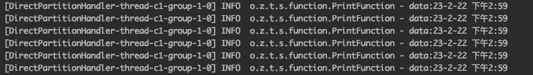

# Tributary Developer Guide

If you are not know of Tributary, please read the [Tributary User Guide](user_guide.md) first.

## Building Tributary

Checkout the code, compile the source code and run unit test.

```shell script
$ git fetch && git checkout master && git pull
$ cd tributary
$ mvn clean install
```

## Preparing

Before developing custom components, loading the project to IDE, recommend developing tributary by Intellij.

Goto [Intellij Plugin Install and Config](intellij_plugin.md) for more details.

Note: The code shown below can be found in the [sample-code-module](../sample-code).

## Developing a simple source of emitting records periodically

The duty of source is received records and append to channel, let's try to develop a simple source emit one record periodically.

### Coding
```java
public class EmitSource implements Source {

    private static final Logger LOG = LoggerFactory.getLogger(EmitSource.class);
    private final AtomicBoolean closed = new AtomicBoolean(false);
    private final Random random = new Random();
    private final Runnable task;
    private Thread t;

    public EmitSource(Channel channel) {
        this.task =
                () -> {
                    while (!closed.get()) {
                        final byte[] data =
                                new SimpleDateFormat()
                                        .format(new Date())
                                        .getBytes(StandardCharsets.UTF_8);
                        try {
                            channel.append(random.nextInt(channel.partition()), data);
                        } catch (IOException e) {
                            LOG.warn("append fail", e);
                        } finally {
                            Threads.sleepQuietly(1000);
                        }
                    }
                };
    }

    @Override
    public void start() {
        t = new Thread(task);
        t.start();
    }

    @Override
    public void close() {
        if (closed.compareAndSet(false, true)) {
            Threads.joinQuietly(t);
        }
    }
}
```   
[EmitSource](../sample-code/src/main/java/org/zicat/tributary/demo/source/EmitSource.java) implements the 
[Source](../tributary-source/src/main/java/org/zicat/tributary/source/Source.java) to emit current time to channel.

```java
public class EmitSourceFactory implements SourceFactory {
    @Override
    public Source createSource(Channel channel, ReadableConfig config) {
        return new EmitSource(channel);
    }

    @Override
    public String identity() {
        return "periodEmitSource";
    }
}
```
[EmitSourceFactory](../sample-code/src/main/java/org/zicat/tributary/demo/source/EmitSourceFactory.java) implements the
[SourceFactory](../tributary-source/src/main/java/org/zicat/tributary/source/SourceFactory.java) to create the instance by Java SPI.

Create a file if not exist
named [org.zicat.tributary.source.SourceFactory](../sample-code/src/main/resources/META-INF/services/org.zicat.tributary.source.SourceFactory)
in [resources/META-INF/services](../sample-code/src/main/resources/META-INF/services), append the full class name
of [EmitSourceFactory](../sample-code/src/main/java/org/zicat/tributary/demo/source/EmitSourceFactory.java)

### Testing

1. Create a
   properties [application-source-emit.properties](../sample-code/src/main/resources/application-source-emit.properties)
   set source.s1.implement=periodEmitSource

2. Create a main
   class [EmitSourceDemoApplication](../sample-code/src/main/java/org/zicat/tributary/demo/EmitSourceDemoApplication.java)
   for testing

3. Using intellij Run tool start this main class

4. Check whether print the records from intellij console

   

## Developing http source

In the document [Tributary User Guide of Config Details](user_guide_config_detail.md), how to use the
default implement of netty has been introduced.

Now let's try to develop a simple http source and configure it.

### Coding

Http protocol is a complicated protocol, let's develop http decoder and encoder by the netty framework.

Tributary provide
[AbstractNettySource](../tributary-source/src/main/java/org/zicat/tributary/source/netty/AbstractNettySource.java)
to simplify the code, have a look at how to extend
[AbstractNettySource](../tributary-source/src/main/java/org/zicat/tributary/source/netty/AbstractNettySource.java)
implement [HttpSource](../sample-code/src/main/java/org/zicat/tributary/demo/source/HttpSource.java)
.

Note:

1. Add necessary http decoder and encoder, the duty
   of [SimpleHttpHandler](../sample-code/src/main/java/org/zicat/tributary/demo/source/SimpleHttpHandler.java)
   defined in the
   [HttpSource](../sample-code/src/main/java/org/zicat/tributary/demo/source/HttpSource.java)
   is to parse streaming as records from http body and append to the channel.
2. The channel may have multi
   partitions, [SimpleHttpHandler](../sample-code/src/main/java/org/zicat/tributary/demo/source/SimpleHttpHandler.java)
   select one partition to append by the policy of random.
3. Response the length of the received record.

[HttpSourceFactory](../sample-code/src/main/java/org/zicat/tributary/demo/source/HttpSourceFactory.java)
is a factory to create
[HttpSource](../sample-code/src/main/java/org/zicat/tributary/demo/source/HttpSource.java), the identity will be used in application.properties.

Create a file if not exist
named [org.zicat.tributary.source.SourceFactory](../sample-code/src/main/resources/META-INF/services/org.zicat.tributary.source.SourceFactory)
in [resources/META-INF/services](../sample-code/src/main/resources/META-INF/services), append the full class name
of [HttpSourceFactory](../sample-code/src/main/java/org/zicat/tributary/demo/source/HttpSourceFactory.java)
.

### Testing

1. Create a
   properties [application-source-demo.properties](../sample-code/src/main/resources/application-source-demo.properties)
   set source.s1.implement=http

2. Create a main
   class [HttpSourceDemoApplication](../sample-code/src/main/java/org/zicat/tributary/demo/HttpSourceDemoApplication.java)
   for testing

3. Using intellij Run tool start this main class

4. Using terminal to send test records

    ```shell script
     $ curl -s -X POST http://localhost:8200 -d 'Hello Tributary Http Server'
    ```

5. Check whether print the records from intellij console

   
   


## Developing custom sinks

In the document [Tributary User Guide of Config Details](user_guide_config_detail.md), we have introduced 3 kinds of
sink include kafka, hdfs, print. In this section, we introduce more details of kafka.

We suggest reading [Tributary Design Guide](tributary_design_guide.md) first to know the concept of channel and sink
more.

### Sink kafka

The kafka sink need to configure a kafka topic, actually in some scenarios we need to dispatch different records to
different topic, let's implement this feature(All of these codes can be found in the [sample-code](../sample-code)).

```java
public class DispatchKafkaFunction extends DefaultKafkaFunction {

    @Override
    protected boolean sendKafka(byte[] value) {
        final String stringValue = new String(value, StandardCharsets.UTF_8);
        final int index = stringValue.indexOf(",");
        final String topic = stringValue.substring(0, index);
        final String realValue = stringValue.substring(index + 1);
        final ProducerRecord<byte[], byte[]> record =
                new ProducerRecord<>(topic, null, realValue.getBytes(StandardCharsets.UTF_8));
        sendKafka(null, record);
        return true;
    }
}

public class DispatcherKafkaFunctionFactory implements FunctionFactory {
    @Override
    public Function createFunction() {
        return new DispatchKafkaFunction();
    }

    @Override
    public String identity() {
        return "kafka_demo_dispatcher";
    }
}
```

[DispatchKafkaFunction](../sample-code/src/main/java/org/zicat/tributary/demo/sink/DispatchKafkaFunction.java)
extends
[DefaultKafkaFunction](../tributary-sink/tributary-sink-kafka/src/main/java/org/zicat/tributary/sink/kafka/DefaultKafkaFunction.java)
override the sendKafka function. In this case, records are converted into utf-8 string with the topic and value by ','.

[DispatchKafkaFunctionFactory](
../sample-code/src/main/java/org/zicat/tributary/demo/sink/DispatchKafkaFunctionFactory.java) implements
[FunctionFactory](../tributary-sink/tributary-sink-base/src/main/java/org/zicat/tributary/sink/function/FunctionFactory.java)
to override function createFunction to create a DispatchKafkaFunction instance and define an identity of '
kafka_demo_dispatcher'.

Create the file if not exists named
[org.zicat.tributary.sink.function.FunctionFactory](../sample-code/src/main/resources/META-INF/services/org.zicat.tributary.sink.function.FunctionFactory)
in classpath [META-INF/services](../sample-code/src/main/resources/META-INF/services), append the full class name of
[DispatchKafkaFunctionFactory](../sample-code/src/main/java/org/zicat/tributary/demo/sink/DispatchKafkaFunctionFactory.java).

All is ready, let's configure it in the application.properties

```properties
sink.group_kafka.functionIdentity=kafka_demo_dispatcher
sink.group_kafka.partitionHandlerIdentity=direct
#sink.group_kafka.kafka.topic=test_topic
# support all kafka producer configuration, please see kafka official website for more detail
sink.group_kafka.kafka.bootstrap.servers=127.0.0.1:9092
sink.group_kafka.kafka.key.serializer=org.apache.kafka.common.serialization.ByteArraySerializer
sink.group_kafka.kafka.value.serializer=org.apache.kafka.common.serialization.ByteArraySerializer
sink.group_kafka.kafka.buffer.memory=134217728
sink.group_kafka.kafka.linger.ms=1000
sink.group_kafka.kafka.batch.size=524288
sink.group_kafka.kafka.compression.type=snappy
sink.group_kafka.kafka.flushMill=60000
```

Note:

1. The param sink.group_kafka.kafka.topic is not work, because the topic is parsed from the record in kafka_demo_dispatcher.
2. Because DispatchKafkaFunction extends DefaultKafkaFunction, other params are still supported.
