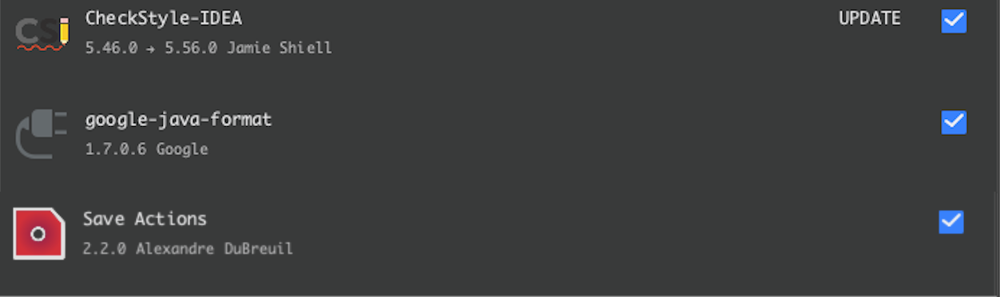
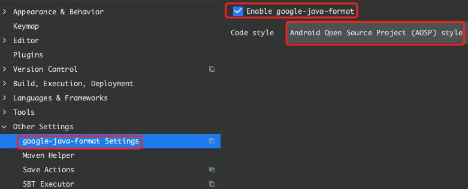
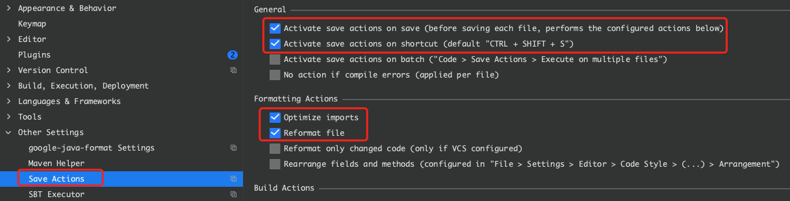
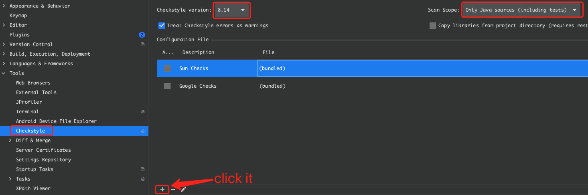
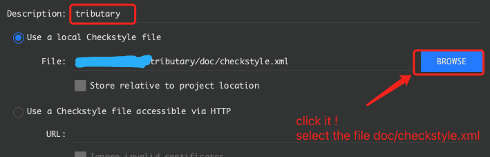
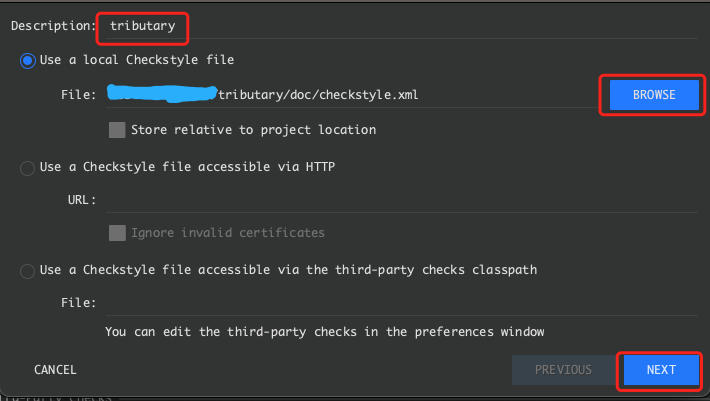
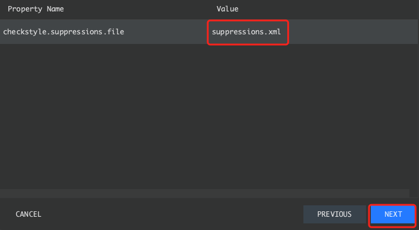
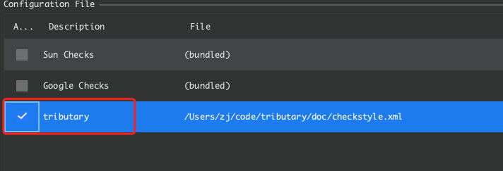

# Intellij Plugin Install and Config

1. Open the project using Intellij.
2. Download some plugins if not installed. 
 
    
    
3. Config the plugin of google-java-format

    

4. Config the plugin of Save Actions

    

5. Config the plugin of CheckStyle
    
    
    
    
    
      
    
    
    
          