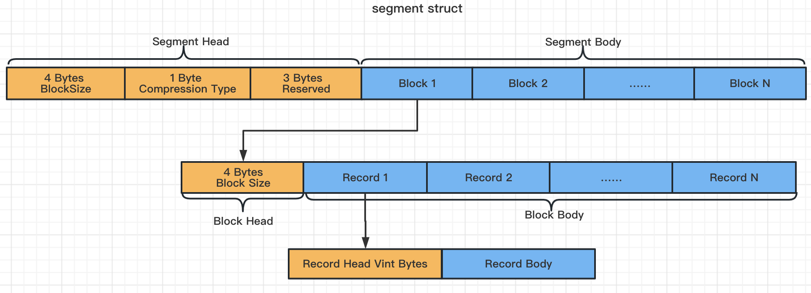
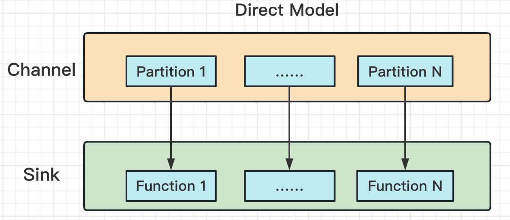
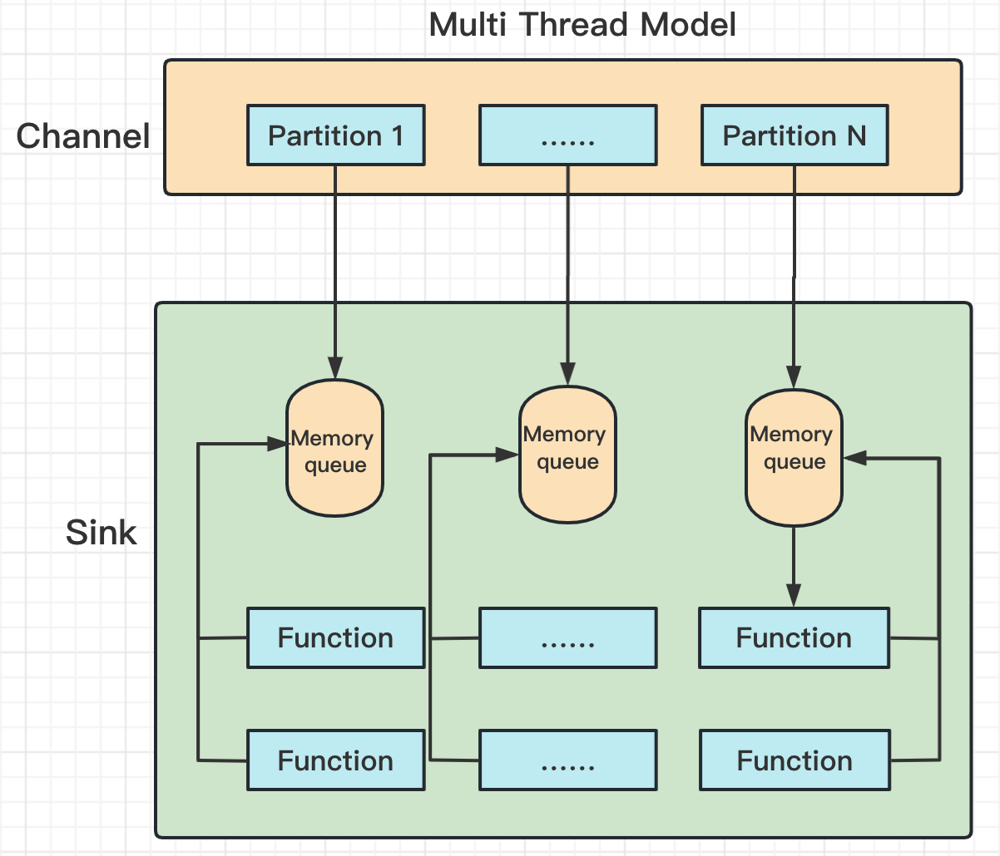

# Tributary Design Guide

In this section, the design of key roles is introduced.

## Channel

The channel in the tributary is designed as a streaming to append records and take records repeatedly to multi sinks.

It is also supported the transaction operation helping sinks promise to consume records and send external system
successfully at least once.

In [Tributary Channel Module](../tributary-channel), the interface of
[Channel](../tributary-channel/src/main/java/org/zicat/tributary/channel/Channel.java) is designed.

## FileChannel Design

To meet above requirements, we need to design a reliable file channel. The file channel depends on disk for persistence, which
ensures the reliability of records and improves the scale of unconsumed records for failure.

When a large amount of records needs to be temporarily stored, the implementation of channel based on memory may cause
serious GC, which may affect the efficiency of records sinking and even cause program crash.

In order to support multiple sinks, sinks need to maintain their own records offset. In case of failure, they only need
to design their own failure strategy, which will not affect the source and other sinks.

## FileChannel Implement

In open source products, it is relatively simple to implement the file channel based on [Apache Kafka](https://kafka.apache.org/), which basically meets the
requirements for channel isolation and reliability. However [Apache Kafka](https://kafka.apache.org/) also has some features not match, including:

1. The design of offset and index

   Kafka locates the actual physical offset of the file based on logical offset. To do this, it is necessary to write an
   index file storing the mapping of logical offset to physical offset, which is a waste of performance.

   In tributary, the channel is designed to directly store physical offset and use physical offset to fetch records
   directly.

2. Kafka Service

   Kafka provide the log operation service, so that each batch of records needs to be transmitted through the network.

   In tributary, the channel is designed to write the records to the local disk reducing the cost of network transmission.

3. Data lifecycle

   In normal, tributary can delete the data file after the consumption of all sinks is completed, which ensures the fast
   release of the operating system page cache and disk usage.

   Kafka does not support to delete segments directly, although Kafka supports setting data expiration. The expiration
   time is too small to cope with the failure scenario.

   In tributary, the channel is designed to retain the data file after the failure until the consumption is resumed.

For the above reasons, the [Tributary-Channel](../tributary-channel)
implements the
[FileChannel](../tributary-channel/src/main/java/org/zicat/tributary/channel/file/FileChannel.java)
based on disk. 

This design ensures that the deployment of the tributary does not require additional external
dependencies, but has certain requirements on the disk space and storage efficiency of the machine.

### Tributary FileChannel Implement

#### About Segment

Because the records in the distribution system often exists in a short life cycle, in theory a record can be deleted
from the disk after it is consumed successfully by all sinks. However, in order to meet the basic characteristics of the
disk, the
[FileChannel](../tributary-channel/src/main/java/org/zicat/tributary/channel/file/FileChannel.java)
manage files in the form of segments.

Segments should not be too small, because frequent creation and deletion will introduce additional performance overhead.

Similarly, segments should not be too large, because too large segments cannot be deleted in time, which will occupy too
many operating system page cache resources. 

The reasonable size of the segment file is about 2G-4G.

The internal data of the segment is managed according to the fixed-size block. The writing operation is responsible for
writing the data to the block. When the block is filled completely, the system calls to write to page cache.

The advantage of the block is that it shields the impact of small data (data less than 4K) , and has great benefits for
stable writing.

Generally, the appropriate block is 32K. If the record itself is larger than 1K, the block can be appropriately
increased.

Segment supports compression(snappy, zstd) based on block granularity. The full block will be compressed first before
written to page cache. Therefore, the size of the block written to disk is different from that in memory.

Go to the source code of
[Segment](../tributary-channel/src/main/java/org/zicat/tributary/channel/file/Segment.java) for more details.

#### About FileChannel

The main functions of the file channel include: segment lifecycle management & disk flushing mechanism & consumption
group management and persistence.

1. segment lifecycle management

   In the segment creation phase, control the thread which is reading the latest offset to wait.

   The file channel ensures that only one write thread is responsible for the operation of current segment, including
   creating a new segment to support append operation, marking it as read-only when it's full, creating a new segment
   and switch it to the current segment, waking up the thread which is reading the latest offset.

   When the file channel is created, start the thread to clean up the expired segments in the cache.

2. disk flushing mechanism

   Generally, the mechanical disk is written at 200mb/s per second, and synchronous disk brushing will inevitably lead
   to the response delay of the writing end.

   Based on the above problems, when the file channel is created, a disk flushing thread is also created which is
   responsible for asynchronous disk flushing of the currently writable segment.

   At the same time, in order to ensure that page cache is overstocked, flush it synchronously when page cache usage
   over the certain size

3. consumption group management and persistence

   It is responsible for writing the offset submitted by the read thread to the disk and providing the minimum offset
   currently consumed. The cleanup thread marks the expired segment according to the offset and cleans it up.

Go to the source code of
[FileChannel](../tributary-channel/src/main/java/org/zicat/tributary/channel/file/FileChannel.java),
[PartitionFileChannel](../tributary-channel/src/main/java/org/zicat/tributary/channel/file/PartitionFileChannel.java),
for more details.

## Sink

[Tributary-Sink](../tributary-sink)
provides two kinds of consumption models based on [Tributary-Channel](../tributary-channel), abstracts the actual
consumption requirements and simplifies the threshold of using the channel.

### Sink Models

The channel supports multi partitions to write and each partition is independent of each other. Based on this
background, the sink models include direct and multi threads.

#### Direct Model

The direct model binds one partition with one thread, it's applicable to scenarios where the consumption rate of a
single thread is higher than the writing rate of a single partition.

Each function in the figure above corresponds to a thread, go to the source code of
[DirectPartitionHandler](../tributary-sink/tributary-sink-base/src/main/java/org/zicat/tributary/sink/handler/DirectPartitionHandler.java)
for details.

#### Multi Threads Model

The multi-threads model binds one partition with multiple threads, it's applicable to scenarios where the consumption
rate of a single thread is lower than the writing rate of a single partition.

Compared with the direct model, the multi-threads model needs to use more cpu and memory resources.

The model has one drawback, that is, it destroys the records order in a single partition, so it is only applicable to
scenarios that are not sensitive to disorder. If you need to ensure order, you can use the direct mode and appropriately
increase the number of partitions from the channel to reduce the writing rate of a single partition, balancing the
production and consumption of a single partition.

In the figure above, two functions corresponds to one thread, go to the source code of
[MultiThreadPartitionHandler](../tributary-sink/tributary-sink-base/src/main/java/org/zicat/tributary/sink/handler/MultiThreadPartitionHandler.java)
for details.

### Function

Both the direct model and the multi-threads model support the configuration of
[AbstractFunction](../tributary-sink/tributary-sink-base/src/main/java/org/zicat/tributary/sink/function/AbstractFunction.java)
to develop the actual sink needs.

[FunctionFactory](../tributary-sink/tributary-sink-base/src/main/java/org/zicat/tributary/sink/function/FunctionFactory.java)
uses Java SPI to inject
the [Function](../tributary-sink/tributary-sink-base/src/main/java/org/zicat/tributary/sink/function/AbstractFunction.java)
instance, users can implement it according to actual needs, such
as [PrintFunction](../tributary-sink/tributary-sink-base/src/main/java/org/zicat/tributary/sink/function/PrintFunctionFactory.java)
,
[DefaultHDFSFunction](../tributary-service/src/main/java/org/zicat/tributary/service/sink/DefaultHDFSFunctionFactory.java)
,
[DefaultKafkaFunction](../tributary-service/src/main/java/org/zicat/tributary/service/sink/DefaultKafkaFunctionFactory.java)
.

#### Trigger

User can define an implement of
the [AbstractFunction](../tributary-sink/tributary-sink-base/src/main/java/org/zicat/tributary/sink/function/AbstractFunction.java)
with the interface
of [Trigger](../tributary-sink/tributary-sink-base/src/main/java/org/zicat/tributary/sink/function/Trigger.java). Set
idleTimeMillis and trigger idleTrigger() function if no records is received for idleTimeMillis.

Tributary service use the trigger feature
in [DefaultHDFSFunction](../tributary-service/src/main/java/org/zicat/tributary/service/sink/DefaultHDFSFunction.java)
to flush the records to hdfs and close the file handler when the idle exceeds the configured time.

