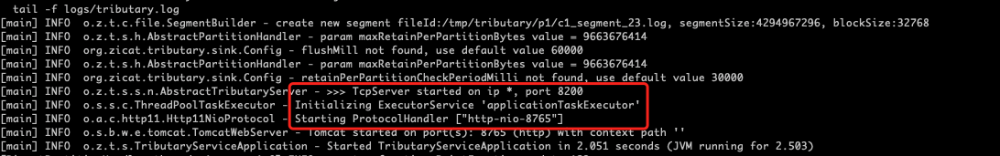
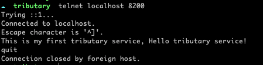
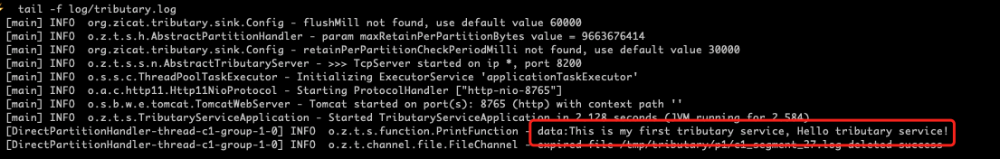

# Tributary User Guide

## Overview

The duty of tributary is to provide records uploading network interface, ensure records integrity and sink records to
multi external systems, ensure the failure of some sinks not to affect other sinks.

## Architecture

A tributary is a jvm-based service process hosts the components through which records flow from a source to a channel to
multi sinks.


### Reliability

When records arrive at the tributary service, the source append into the channel and ack client, sinks fetch records
from the channel with RecordsOffset, and commit the RecordsOffset after external systems store these records. This is a
how records in Tributary provide end-to-end reliability of the flow.

### Recoverability

If the channel crash e.g., disk full, source report the exception to the client. Because tributary service is stateless,
client need to switch to other tributary services and switch back after this service recover.

If the external sink system crash, the sink will roll up to the previous committed RecordsOffset and reconsume records(
at least once). The failure of some sink systems not affect others sinking records.

## Setting up a tributary service

This section documents how to configure the tributary’s application.properties. See the following section for creating a
tributary application using Spring Boot.

### Build package

Before start the tributary service, please compile and package it from source code with java and maven (jdk8 & maven3).

Download source code using Git or other tools.

```shell
$ cd tributary
$ bash sbin/package.sh
$ cd release/tributary  
``` 

If expected, the current dir is the release dir named tributary which contains dirs include bin, config, libs.

### A simple example

Here, the demo config of application.properties in config dir is shown as follows:

```properties
server.port=8765
server.metrics.ip.pattern=.*
source.s1.channel=c1
source.s1.netty.port=8200
source.s1.netty.decoder=lineDecoder
source.s1.implement=netty
channel.c1.type=file
channel.c1.partitions=/tmp/tributary/p1
channel.c1.groups=group_1
channel.c1.compression=snappy
sink.group_1.maxRetainPerPartitionBytes=9663676414
sink.group_1.partitionHandlerIdentity=direct
sink.group_1.functionIdentity=print
```

Note that server.port and source.s1.netty.port is not conflicting and used, channel.c1.partitions must exist and allow
reading and writing.

Given the application.properties, start the tributary service as follows:

```shell
$ bash bin/tributary.sh start
```

Check whether the tributary service start successfully by the log file in log dir.

```shell
$ tail -f log/tributary.log
```



Try to use the telnet to send some records, please attend to the port if source.s1.netty.port changed.



Check whether the tributary service receive and sink records successfully by the log file in log dir.



Check the metrics of the tributary service by http restful api, attend to the port if server.port changed.

```shell
$ curl -s http://localhost:8765/metrics|grep -v '#'
```


Congratulations - you’ve successfully configured and deployed a tributary service!

[Tributary User Guide Of Config Details](user_guide_config_detail.md) cover the application.properties in much more
detail, let's continue.
