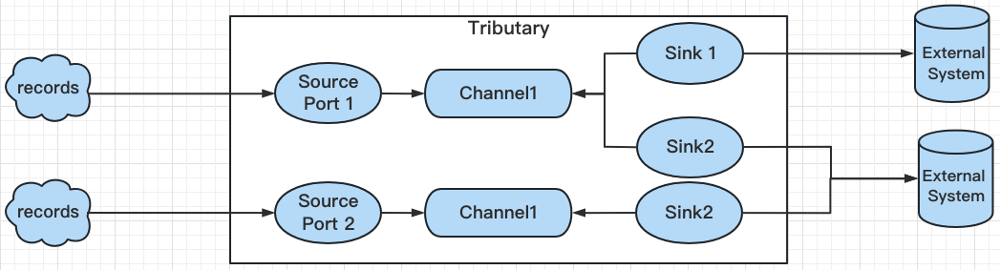

# Tributary User Guide

## Overview

The responsibilities of Tributary include providing a network interface for recording reporting,
ensuring data reliability, distributing data to multiple external systems while ensuring that
partial external system failures do not affect the data distribution of other external systems.

## Architecture

A tributary is a jvm-based service process hosts the components through which records flow from a
source to a channel to
multi sinks.


### Reliability

When the record is sent to the Tributary service, the source is responsible for writing the data to
the channel and ack the client. The sinks pull the records from the channel based on their
respective GroupOffsets. When the external system successfully stores these records, it submits the
GroupOffset, which is the end-to-end reliability flow design of Tributary.

### Recoverability

If a channel experiences a malfunction, such as disk damage or reaching full capacity, the source
will inform the client of the relevant problem. As Tributary service is stateless, the client is
responsible for maintaining the health of all Tributary instances and making necessary adjustments
in case of malfunctions.

If there is an external system failure for the sink, it will roll back to the previously committed
GroupOffset and re-consume to ensure at-least-one successful consumption. Partial sink failures will
not affect other sinks.

## Setting up a tributary service

This section documents how to configure the tributary’s application.properties. See the following
section for creating a tributary application.

### Download package

Before start the tributary service, please install java8 first.

```shell
$ wget https://github.com/zicat/tributary/releases/download/v1.4.0/tributary.zip
$ unzip tributary.zip
$ cd tributary  
``` 

If everything goes well, the current directory will be the release directory named "tributary",
which includes three subdirectories: "bin", "config", and "libs".

### A simple example

Here, a simple config of application.properties in config dir is shown as follows:

```properties
server.port=8765
source.s1.channel=c1
source.s1.implement=netty
source.s1.netty.port=8200
source.s1.netty.decoder=lineDecoder
channel.c1.type=memory
channel.c1.groups=group_1
sink.group_1.function.id=print
```

Please note that the port configuration for server.port and source.s1.netty.port should not be
duplicated and must not be occupied by other processes.

Start the Tributary service by using this application.properties as follows

```shell
$ bash bin/tributary.sh start
```

Check whether Tributary has started successfully by checking the log files in the log directory.

```shell
$ tail -f log/tributary.log
[main] INFO  o.z.t.s.n.AbstractNettySource - >>> TcpServer started on ip *, port 8200
[main] INFO  o.z.t.s.component.DynamicSource - create source success, sources [s1]
[main] INFO  o.s.s.c.ThreadPoolTaskExecutor - Initializing ExecutorService 'applicationTaskExecutor'
[main] INFO  o.a.c.http11.Http11NioProtocol - Starting ProtocolHandler ["http-nio-8765"]
[main] INFO  o.s.b.w.e.tomcat.TomcatWebServer - Tomcat started on port(s): 8765 (http) with context path ''
[main] INFO  o.z.t.s.TributaryServiceApplication - Started TributaryServiceApplication in 3.83 seconds (JVM running for 4.672)
```

Try to use the telnet to send some records, please attend to the port if source.s1.netty.port
changed.

```shell
$ telnet localhost 8200
Trying ::1...
Connected to localhost.
Escape character is '^]'.
This is my first tributary service, Hello tributary service!
quit
```

Check whether the tributary service receive and sink records successfully by the log file in log
dir.

```text
[DirectPartitionHandler-thread-c1-group-1-0] INFO  o.z.t.s.function.PrintFunction -
       Key: 
       Value: This is my first tributary service, Hello tributary service!
       Headers: [_rec_ts:1719543829930]
```

Attempt to send some records through telnet, and please note that the port in the command needs to
match the configuration of source.s1.netty.port.

```shell
$ curl -s http://localhost:8765/metrics|grep -v '#'
sink_print_counter{host="127.0.0.1",id="c1_group_1_0",} 1.0
channel_block_cache_query_hit_count{topic="c1",host="127.0.0.1",} 1.0
channel_buffer_usage{topic="c1",host="127.0.0.1",} 0.0
channel_write_bytes{topic="c1",host="127.0.0.1",} 95.0
channel_active_segment{topic="c1",host="127.0.0.1",} 1.0
channel_read_bytes{topic="c1",host="127.0.0.1",} 95.0
channel_block_cache_query_total_count{topic="c1",host="127.0.0.1",} 1.0
sink_lag{host="127.0.0.1",id="c1_group_1",} 0.0
```

Congratulations - you’ve successfully configured and deployed a tributary service!

[Tributary User Guide Of Config Details](user_guide_config_detail.md) cover more details about the
application.properties, let's continue.
                                                                           
