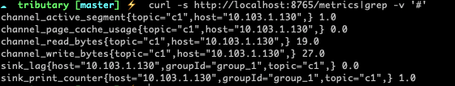

# Tributary User Guide of Config Details

Tributary Config is consists of 4 parts include server, source, channel and sink.

## Server Detail

```properties
server.port=8765
server.metrics.ip.pattern=.*
```

Tributary service provider metrics http restful api base on SpringBoot, get more details abort server.* by SpringBoot Document.

The param server.metrics.ip.pattern is a pattern, filter hosts(the server may has multi network adapter cards) and get the expected matched host as metrics dimension
value. Tributary provide the http restful api to exposure metrics like sink_lag, sink_counter, most metrics need the
dimension of host.

Got the metrics of the tributary service like below, attend to the port if server.port changed.



|  Key                          |  default       | valid value                  | describe                                             |
|  ----                         | ----           | ---                          | ---                                                  |
| server.port                   |                | 1000-65535                   | port to bind                                         |
| server.metrics.ip.pattern     | .*             | pattern rule                 | filter expected host as metrics dimension value      |

## Source Detail

Tributary support to define multi sources in the application.properties.

The source must bind a channel and implement like below

```properties
source.s1.channel=c1
source.s1.implement=netty
source.s2.channel=c2
source.s2.implement=netty
``` 

We define two sources named s1 bind the channel named c1 and s2 bind the channel named c2.

The source must config implement to receive records from the network.

Tributary provide
the [TributaryServerFactory](../tributary-service/src/main/java/org/zicat/tributary/service/source/TributaryServerFactory.java)
interface for users to create special sources suitable business.

Tributary as provide the default implement [netty](../tributary-service/src/main/java/org/zicat/tributary/service/source/netty/NettyTributaryServerFactory.java)
, below shows all params netty required.

```properties
source.s1.netty.port=8200
source.s1.netty.threads=10
source.s1.netty.idle.second=60
source.s1.netty.decoder=lineDecoder
```

|  key              |  default       | valid value                  | describe                                             |
|  ----             | ----           | ---                          | ---                                                  |
| netty.port        |                | 1000-65535                   | port to bind                                         |
| netty.threads     | 10             | > 0                           | netty event loop threads                             |
| netty.idle.second | 120            | > 0                           | how long wait to close the idle channel |
| netty.decoder     | lengthDecoder  | [lengthDecoder,lineDecoder]  |  streaming decode                                 |

Note：

1. Different source use different netty.port

2. The lineDecoder parse the streaming to records by text line. It is suitable for demo scenarios using telnet.

3. The lengthDecoder parse the streaming by length-value decode like below, it's suitable for production environment.

   

Tributary provide the lengthDecoder java
client [TributaryClientTest](../tributary-service/src/test/java/org/zicat/tributary/service/test/TributaryClientTest.java)
for reference.

## Channel Detail

A channel like data streaming can be appended data and consumed data by sinks repeatedly, the channel also has the
ability of persistence.

Tributary service support to define multi channels in the application.properties.

```properties
channel.c1.dirs=/tmp/tributary/p1,/tmp/tributary/p3
channel.c1.groups=group_1,group_2
channel.c1.compression=snappy
channel.c1.blockSize=262144
channel.c1.segmentSize=4294967296
channel.c1.flushPeriodMills=1000
channel.c1.flushPageCacheSize=67108864
channel.c1.flushForce=true
channel.c2.dirs=/tmp/tributary/p2
channel.c2.groups=group_2
channel.c2.compression=snappy
channel.c2.blockSize=262144
channel.c2.segmentSize=4294967296
channel.c2.flushPeriodMills=1000
channel.c2.flushPageCacheSize=67108864
channel.c2.flushForce=true
```

We define two channels named c1, c2 with params.

|  key              |  default       | valid value                  | describe                                             |
|  ----             | ----           | ---                          | ---                                                  |
| dir               |                | valid absolute path          | the dir to store data, dir must be readable and writable, use ',' to config the channel with multi partitions |
| groups            |                | string value                 | the groups that consume this channel                             |
| compression       | none           | [none,zstd,snappy]           | compress records before writing records to page cache, snappy suggested  |
| blockSize         | 32768(32K)     | long value(unit: byte)       | records are appended to the memory block first, after the block over this param the channel flush the block to page cache|
| segmentSize       | 4294967296(4G) | long value(unit: byte)       | roll new file if the size of current segment file in the channel is over this param |
| flushPeriodMills  | 500            | long value(unit: ms)         | async flush page cache to disk period|
| flushPageCacheSize| 33554432(32M)  | long value(unit: byte)       | sync flush page cache to disk|
| flushForce        | false          | [false,true] | whether records in the block flush to page cache first before flush page cache to disk, suggest to set false on production|

Note:

1. Using suitable blockSize like 32768. Lower value like 1K may cause disk iops high, higher value like 1M may cause
   source timeout.
2. Using suitable segmentSize like 4294967296. Lower value cause frequent file creation/deletion, higher value cause
   deleting expired files not timely.
3. The purpose of setting flushForce=true is to reduce consumption delay, If the size of receive records is lower than
   blockSize, sinks cannot consume these records because the block is unreadable.
4. If we define multi channels, please set different values of the dir, set same values may cause unknown exceptions.

## Sink Detail

Tributary support to define multi sinks.

```properties
sink.group_1.maxRetainPerPartitionBytes=9663676414
sink.group_1.partitionHandlerIdentity=direct
sink.group_1.functionIdentity=hdfs
sink.group_2.maxRetainPerPartitionBytes=9663676414
sink.group_2.partitionHandlerIdentity=multi_thread
sink.group_2.threads=3
sink.group_2.functionIdentity=kafka
``` 

key                               |  default       | valid value                  | describe                                                                  |
|  ----                             | ----           | ---                          | ---                                                                       |
| maxRetainPerPartitionBytes        |                | long value                   | sink expired the oldest segment file in the channel if sink lag is over maxRetainPerPartitionBytes, the param may cause data lost, be careful     |
| partitionHandlerIdentity          | direct         | [direct,multi_thread]        | set sink mode, direct mode combine one channel's partition with one thread, multi_thread mode combine one channel's partition with multi threads|
| threads                           | 2              |int value | set multi_thread mode thread count, only valid when partitionHandlerIdentity=multi_thread |  
| functionIdentity                  |                | [print,kafka,hdfs]           | set the function identity that configure how to consume records  |

Note:

1. User can customize functions by
   implements [FunctionFactory](../tributary-sink/tributary-sink-base/src/main/java/org/zicat/tributary/sink/function/FunctionFactory.java)
2. Print function receive records from channels and log it, kafka function send records to kafka server, hdfs function
   send records to hdfs.

### Sink HDFS Detail

```properties
sink.group_1.sinkPath=/tmp/test/cache
sink.group_1.roll.size=10240000
sink.group_1.bucketDateFormat=yyyyMMdd_HH
sink.group_1.maxRetries=3
sink.group_1.keytab=
sink.group_1.principle=
sink.group_1.idleTriggerMillis=60000
```

key                               |  default       | valid value                  | describe    |
|  ----                             | ----           | ---                          | ---                                                                       
| sinkPath                          |                | valid path                   | the root path to sink |
| roll.size                         |268435456(256M) | long value(unit: byte)       | roll a new file if the file size over roll.size|
| bucketDateFormat                  |yyyyMMdd_HH     | string data format  |hdfs sink use bucketDateFormat(process time) to create bucketId, the real path is ${sinkPath}/${bucketId}/ |   
| maxRetries                        |3               | int value| retry times when operate hdfs fail|
| keytab                            |                | string value|            set keytab if hdfs use kerberos authenticator|
| principle                         |                | string value|            set principle if hdfs use kerberos authenticator|
| idleTriggerMillis                 |60000           | long value(unit: millis)| when function not receive records after idleTriggerMillis, trigger idle function callback|

### Sink Kafka Detail

```properties
sink.group_2.kafka.topic=test_topic
sink.group_2.kafka.bootstrap.servers=127.0.0.1:9092
sink.group_2.kafka.key.serializer=org.apache.kafka.common.serialization.ByteArraySerializer
sink.group_2.kafka.value.serializer=org.apache.kafka.common.serialization.ByteArraySerializer
sink.group_2.kafka.buffer.memory=134217728
sink.group_2.kafka.linger.ms=1000
sink.group_2.kafka.batch.size=524288
sink.group_2.kafka.compression.type=snappy
sink.group_2.kafka.flushMill=60000
```

|key                               |  default       | valid value                  | describe                                                                  |
|  ----                             | ----           | ---                          | ---                                                                       |
| kafka.topic                       |                | string value                 | kafka topic name|

Tributary support all kafka producer
params, [apache kafka producer config](https://kafka.apache.org/documentation/#producerconfigs) .

## The complete demo config

```
server.port=8765
server.metrics.ip.pattern=.*

source.s1.channel=c1
source.s1.implement=netty
source.s1.netty.port=8200
source.s1.netty.threads=10
source.s1.netty.idle.second=60

source.s2.channel=c2
source.s2.implement=netty
source.s2.netty.port=8300
source.s2.netty.threads=5
source.s2.netty.idle.second=120
source.s2.netty.decoder=lineDecoder

channel.c1.dirs=/tmp/tributary/p1,/tmp/tributary/p3
channel.c1.groups=group_1,group_2
channel.c1.compression=snappy
channel.c1.blockSize=262144
channel.c1.segmentSize=4294967296
channel.c1.flushForce=true
channel.c1.flushPeriodMills=1000
channel.c1.flushPageCacheSize=67108864

channel.c2.dirs=/tmp/tributary/p2
channel.c2.groups=group_2
channel.c2.compression=snappy
channel.c2.blockSize=262144
channel.c2.segmentSize=4294967296
channel.c2.flushForce=true
channel.c2.flushPeriodMills=1000
channel.c2.flushPageCacheSize=67108864

sink.group_1.maxRetainPerPartitionBytes=9663676414
sink.group_1.partitionHandlerIdentity=direct
sink.group_1.functionIdentity=hdfs
sink.group_1.sinkPath=/tmp/test/cache
sink.group_1.roll.size=10240000
sink.group_1.bucketDateFormat=yyyyMMdd_HH
sink.group_1.maxRetries=3
sink.group_1.keytab=
sink.group_1.principle=
sink.group_1.idleTriggerMillis=60000

sink.group_2.maxRetainPerPartitionBytes=9663676414
sink.group_2.partitionHandlerIdentity=multi_thread
sink.group_2.threads=3
sink.group_2.functionIdentity=kafka
sink.group_2.kafka.bootstrap.servers=127.0.0.1:9092
sink.group_2.kafka.topic=test_topic
sink.group_2.kafka.key.serializer=org.apache.kafka.common.serialization.ByteArraySerializer
sink.group_2.kafka.value.serializer=org.apache.kafka.common.serialization.ByteArraySerializer
sink.group_2.kafka.buffer.memory=134217728
sink.group_2.kafka.linger.ms=1000
sink.group_2.kafka.batch.size=524288
sink.group_2.kafka.compression.type=snappy
sink.group_2.kafka.flushMill=60000

```       