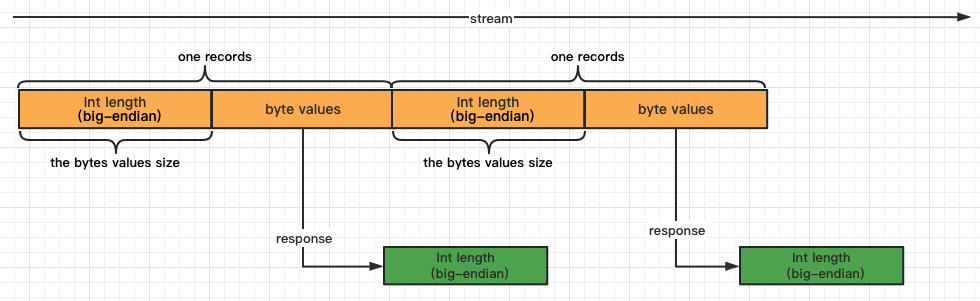

# Tributary User Guide of Config Details

Tributary Configuration consists of four parts, including server, source, channel, and sink.

## Server

```properties
server.port=9090
server.host-pattern=127.0.0.1
```

The Tributary service provides indicators in the form of http restful api.

The parameter "server.host-pattern" is a regular expression that is used to filter the
required hosts when there are multiple network cards in the machine.

### Metrics Api

Get tributary metrics as follows.

```shell
$ curl -s 'http://localhost:9090/metrics'|grep -v '#'
sink_print_counter{host="127.0.0.1",id="c1_group_1_0",} 1.0
channel_block_cache_query_hit_count{topic="c1",host="127.0.0.1",} 1.0
channel_buffer_usage{topic="c1",host="127.0.0.1",} 0.0
channel_write_bytes{topic="c1",host="127.0.0.1",} 95.0
channel_active_segment{topic="c1",host="127.0.0.1",} 1.0
channel_read_bytes{topic="c1",host="127.0.0.1",} 95.0
channel_block_cache_query_total_count{topic="c1",host="127.0.0.1",} 1.0
sink_lag{host="127.0.0.1",id="c1_group_1",} 0.0
```

### Rest Api

1. Show offsets

   ```shell
   $ curl -s 'http://localhost:9090/api/offsets/show'
   [{"topic":"c1","group":"group_1","partitionOffsets":[{"partition":0,"offset":{"segmentId":0,"offset":119}}]}]
   ```

| Key                   | default           | valid value | describe                                                                                                             |
|-----------------------|-------------------|-------------|----------------------------------------------------------------------------------------------------------------------|
| server.port           | 9090              | int(number) | the port to bind, range 1000-65535                                                                                   |
| server.worker-threads | 1                 | int(number) | the work thread to deal with request                                                                                 |
| server.host-pattern   | null              | string      | the pattern the config the output metrics value, default null means using `InetAddress.getLocalHost().getHostName()` |
| server.path.metrics   | /metrics          | string      | the metrics http path                                                                                                |
| path.api-offsets-show | /api/offsets/show | string      | the api offsets show http path                                                                                       |

## Source

Tributary supports defining multiple sources in the application.properties

Each source must be associated with a channel and its implementation as follows

```properties
source.s1.channel=c1
source.s1.channel.append-result-type=block
source.s1.implement=netty
source.s2.channel=c2
source.s2.channel.append-result-type=storage
source.s2.implement=netty
``` 

Above are defined two sources named s1 and s2, in which s1 is bound to channel c1 and s2 is bound to
channel c2, and their implementations are both Netty.

The source must config the implement to receive data, convert
as [Records](../tributary-common/src/main/java/org/zicat/tributary/common/records/Records.java) and
append to channel for sinks to consume.

| key                        | default | type   | describe                                                                                                                                                                                                                                                                                                                                                                                                 |
|----------------------------|---------|--------|----------------------------------------------------------------------------------------------------------------------------------------------------------------------------------------------------------------------------------------------------------------------------------------------------------------------------------------------------------------------------------------------------------|
| channel                    |         | string | the channel to append records                                                                                                                                                                                                                                                                                                                                                                            |   
| implement                  | netty   | string | the [SourceFactory](../tributary-source/tributary-source-base/src/main/java/org/zicat/tributary/source/base/SourceFactory.java) identity                                                                                                                                                                                                                                                                 |
| channel.append-result-type | block   | enum   | the type of channel append result, `block` means return after append to channel block successfully, `storage` means the source will await(the max waiting time depends on file channel param `flush.period`) until channel flush data to storage successfully. For `memory` channel this param is useless, for `file` channel the `storage` means waiting data flushing in os pagecache instead of disk. |

Tributary provide the
[SourceFactory](../tributary-source/tributary-source-base/src/main/java/org/zicat/tributary/source/base/SourceFactory.java)
interface that supports the development of specific sources scenarios.

Tributary also provides the default implementation of
[NettySourceFactory](../tributary-source/tributary-source-base/src/main/java/org/zicat/tributary/source/base/netty/NettySourceFactory.java),
which supports receiving data from the network. The configuration parameters for Netty are as
follows :

```properties
source.s1.netty.host-patterns=10\\.103\\.1\\..*,localhost
source.s1.netty.port=8200
source.s1.netty.threads.event-loop=10
source.s1.netty.idle=60sec
source.s1.netty.decoder=line
source.s1.netty.option.SO_BACKLOG=256
source.s1.netty.option.SO_RCVBUF=1048576
source.s1.netty.child-option.SO_RCVBUF=1048576
source.s1.netty.child-option.SO_KEEPALIVE=true
```

| key                      | default | type                                                       | describe                                                                                                                                                                                                                         |
|--------------------------|---------|------------------------------------------------------------|----------------------------------------------------------------------------------------------------------------------------------------------------------------------------------------------------------------------------------|
| netty.host-patterns      | null    | string                                                     | the host to bind, default null means bind \*, one port can bind multi host split by`,`, localhost means bind loop back address, 10\\.103\\.1\\..* means bind the first InetAddress on the machine matching start with 10.103.1.* |   
| netty.port               |         | int(number)                                                | the port to bind, range 1000-65535                                                                                                                                                                                               |
| netty.threads.event-loop | 10      | int(number)                                                | the count of netty event loop threads                                                                                                                                                                                            |
| netty.idle               | 120sec  | duration                                                   | the idle time to close the socket                                                                                                                                                                                                |
| netty.decoder            | N/A     | enum [length,line,kafka,http,logstash-http,logstash-beats] | the parser of network streaming                                                                                                                                                                                                  |
| netty.option.*           | N/A     | string                                                     | the netty server bootstrap option, refer to [ChannelOption](https://netty.io/4.1/api/io/netty/channel/ChannelOption.html), only support base java class type like Integer, Boolean, String...                                    |
| netty.child-option.*     | N/A     | string                                                     | the netty child channel option, refer to [ChannelOption](https://netty.io/4.1/api/io/netty/channel/ChannelOption.html), only support base java class type like Integer, Boolean, String...                                       |

### Netty Decoder

The `netty.decoder` configuration is used to parse the streaming records received by the Netty,
Supported decoders are as follows:

#### line

The line decoder parses streaming records line by line, making it more suitable for scenarios
where telnet is used for demonstrations.

#### length

The length decoder parses streaming records by length-value like below, making it more suitable
for most scenarios.


Tributary provide the length decoder java
client [LengthDecoderClient](../sample-code/src/main/java/org/zicat/tributary/demo/client/LengthDecoderClient.java)
for reference.

#### kafka

The kafka decoder parses streaming records
by [kafka-producer-protocol](https://kafka.apache.org/protocol#The_Messages_Produce). It supports
more configuration as follows:

| key                                                | default         | type          | describe                                                                                                                                                                                                        |
|----------------------------------------------------|-----------------|---------------|-----------------------------------------------------------------------------------------------------------------------------------------------------------------------------------------------------------------|
| netty.decoder.kafka.advertised-host-pattern        | N/A             | string        | the pattern to advertise the host and register it in zookeeper, tributary will get the first InetAddress on the machine matching by pattern, like localhost or 10\\.103\\.1\\..*                                |
| netty.decoder.kafka.cluster.id                     | ${sourceId}     | string        | the kafka cluster to response when the client send [MetadataRequest](https://kafka.apache.org/protocol#The_Messages_Metadata)                                                                                   |
| netty.decoder.kafka.zookeeper.connect              |                 | string        | the zookeeper host path to register the tributary instance for instance discovery, like: localhost:2181,localhost:2182/tributary_source_kafka                                                                   |
| netty.decoder.kafka.zookeeper.meta.ttl             | 10sec           | duration      | the zookeeper nodes cache ttl                                                                                                                                                                                   |
| netty.decoder.kafka.zookeeper.connection.timeout   | 15sec           | duration      | the zookeeper client connection timeout                                                                                                                                                                         |
| netty.decoder.kafka.zookeeper.session.timeout      | 60sec           | duration      | the zookeeper client session timeout                                                                                                                                                                            |
| netty.decoder.kafka.zookeeper.retry.times          | 3               | int(number)   | the zookeeper client retry times when call zookeeper server exception                                                                                                                                           |
| netty.decoder.kafka.zookeeper.fail.base.sleep.time | 1sec            | duration      | the zookeeper client sleep time before next retry                                                                                                                                                               |
| netty.decoder.kafka.topic.partitions               | 60              | int(number)   | the topic partitions to response when the client send [MetadataRequest](https://kafka.apache.org/protocol#The_Messages_Metadata), recommend to set as multiples of tributary instances count for load balancing |
| netty.decoder.kafka.worker-threads                 | 10              | int(number)   | the worker threads to process kafka protocol data, default 10.                                                                                                                                                  |
| netty.decoder.kafka.ssl.client.auth                | none            | enum[none]    | the ssl client auth type, default none means only using server ssl checking                                                                                                                                     |
| netty.decoder.kafka.ssl.enabled.protocols          | TLSv1.2,TLSv1.3 | array<string> | the support ssl protocols, split by `,`                                                                                                                                                                         |                                                                                                                                                                   
| netty.decoder.kafka.ssl.keystore.type              | JKS             | enum[JKS]     | the keystore type, only support `JKS`                                                                                                                                                                           |
| netty.decoder.kafka.ssl.keystore.location          | null            | string        | the keystore location path, find the classpath first then find in path                                                                                                                                          |
| netty.decoder.kafka.ssl.keystore.password          | null            | string        | the keystore password to read keystore file                                                                                                                                                                     |
| netty.decoder.kafka.ssl.key.password               | null            | string        | the key password to get private key from keystore file                                                                                                                                                          |
| netty.decoder.kafka.ssl.timeout                    | 10sec           | duration      | the ssl handle timeout                                                                                                                                                                                          |
| netty.decoder.kafka.sasl.mechanism=PLAIN           | null            | enum          | the sasl mechanism, only support value `PLAIN`                                                                                                                                                                  |
| netty.decoder.kafka.sasl.plain.usernames           | null            | string        | the plain users configuration if sasl.mechanism=PLAIN, config multi user-password pairs splitting by `,`, user-password is split by `_`, like user1_16Ew658jjzvmxDqk,user2_bbbb,user3_cccc                      |

#### http

The http decoder parses streaming records by http protocol. It supports more configuration as
follows:

| key                                   | default | type   | describe                                                                                                                   |
|---------------------------------------|---------|--------|----------------------------------------------------------------------------------------------------------------------------|
| netty.decoder.http.path               | null    | string | the http path to match, if null means match any path. If the http path not matched, will return http 400 code(bad request) |
| netty.decoder.http.content-length-max | 16mb    | int    | the limited content length, the http body over this will refused                                                           |
| netty.decoder.http.user               | null    | string | the http user to authenticate, if null means no authentication required                                                    |
| netty.decoder.http.password           | null    | string | the http password to authenticate, if null means no authentication required                                                |
| netty.decoder.http.worker-threads     | 10      | int    | the worker threads to process http data.                                                                                   |

The http request demo as follows, before send request please start tributary
with [http source config](../sample-code/src/main/resources/application-http-source-print-sink.properties)
first:

```shell
$ curl -X POST http://localhost:8200?topic=my_topic&partition=10 \
     -H "Content-Type: application/json; charset=UTF-8" \
     -H "my_records_header: hv1" \
     -d '[{"key":"key1","value":"value1","headers":{"header1":"value1","header2":"value2"}}]' -i
```

#### logstash-beats

The logstash beats decoder parses streaming records by logstash beats input protocal. It supports more configuration as
follows:

| key                                                          | default | type   | describe                                                                                                                                                                                                                                                              |
|--------------------------------------------------------------|---------|--------|-----------------------------------------------------------------------------------------------------------------------------------------------------------------------------------------------------------------------------------------------------------------------|
| netty.decoder.logstash-beats.worker-threads                  | 10      | int    | the worker threads to process beats data, default 10.                                                                                                                                                                                                                 |
| netty.decoder.logstash-beats.ssl                             | false   | bool   | whether use ssl to decode beats data, default false.                                                                                                                                                                                                                  |
| netty.decoder.logstash-beats.ssl.certificate.authorities     | null    | string | the authorities ca path, find the classpath first then find in path                                                                                                                                                                                                   |
| netty.decoder.logstash-beats.ssl.certificate                 | null    | string | the server ca path, find the classpath first then find in path                                                                                                                                                                                                        |
| netty.decoder.logstash-beats.ssl.key                         | null    | string | the server key path, find the classpath first then find in path                                                                                                                                                                                                       |
| netty.decoder.logstash-beats.message-filter-factory.identity | null    | string | the spi identity of [MessageFilterFactory](../tributary-source/tributary-source-logstash-base/src/main/java/org/zicat/tributary/source/logstash/base/MessageFilterFactory.java) to filter the message, default null means no filter                                   |
| netty.decoder.logstash-beats.local-file-message-filter.path  | N/A     | string | the local file path when set `netty.decoder.logstash-http.message-filter-factory.identity`=`localFileMessageFilter`, the content of file is a java file that implements interface MessageFilter, tributary will listen the change and build code runtime and apply it |

The logstash beat request demo as follows, before send request please start tributary
with [logstash beats source config](../sample-code/src/main/resources/application-logstash-beats-source-print-sink.properties)
first:

```sheel
$ cat > filebeat.yml <<EOF
filebeat.inputs:
- type: stdin

output.logstash:
  hosts: ["localhost:5044"]
  index: filebeat
EOF
$ filebeat -c filebeat.yml
sadfasdfasdfads
123123123
sadfasfasdfasdf
```

#### logstash-http

The logstash http decoder parses streaming records by logstash http input protocal. It supports more configuration as
follows:

| key                                                         | default | type          | describe                                                                                                                                                                                                                                                              |
|-------------------------------------------------------------|---------|---------------|-----------------------------------------------------------------------------------------------------------------------------------------------------------------------------------------------------------------------------------------------------------------------|
| netty.decoder.logstash-http.path                            | null    | string        | the http path to match, if null means match any path. If the http path not matched, will return http 400 code(bad request)                                                                                                                                            |
| netty.decoder.logstash-http.content-length-max              | 16mb    | int           | the limited content length, the http body over this will refused                                                                                                                                                                                                      |
| netty.decoder.logstash-http.user                            | null    | string        | the http user to authenticate, if null means no authentication required                                                                                                                                                                                               |
| netty.decoder.logstash-http.password                        | null    | string        | the http password to authenticate, if null means no authentication required                                                                                                                                                                                           |
| netty.decoder.logstash-http.worker-threads                  | 10      | int           | the worker threads to process http data.                                                                                                                                                                                                                              |
| netty.decoder.logstash-http.codec                           | plain   | enum          | the codec to decode the http body, default plain, support plain and json, if use plain the key named `message` add to top, if use json the keys in json will add to top                                                                                               |
| netty.decoder.logstash-http.tags                            | null    | array<string> | the tags to add to the record, split by `,`, if not null, the key named `tags` add to top                                                                                                                                                                             |
| netty.decoder.logstash-http.request_headers_target_field    | null    | string        | the target field to store the request headers, if not null, the key set as the target field add to top and the request headers as it's map value                                                                                                                      |
| netty.decoder.logstash-http.remote_host_target_field        | null    | string        | the target field to store the remote host, if not null, the key set as the target field add to top and the remote host as it's value                                                                                                                                  |
| netty.decoder.logstash-http.message-filter-factory.identity | null    | string        | the spi identity of [MessageFilterFactory](../tributary-source/tributary-source-logstash-base/src/main/java/org/zicat/tributary/source/logstash/base/MessageFilterFactory.java) to filter the message, default null means no filter                                   |
| netty.decoder.logstash-http.local-file-message-filter.path  | N/A     | string        | the local file path when set `netty.decoder.logstash-http.message-filter-factory.identity`=`localFileMessageFilter`, the content of file is a java file that implements interface MessageFilter, tributary will listen the change and build code runtime and apply it |

The logstash http request demo as follows, before send request please start tributary
with [logstash http source config](../sample-code/src/main/resources/application-logstash-http-source-print-sink.properties)
first:

```sheel
$ curl -u user1:password1 -X POST "http://localhost:11223/" \
      -H "Content-Type: application/text" \
      -d '{"aa":"bb"}'
```

## Channel

A channel is like a data stream that can append records and allow sinks to consume data
independently.

Some types of channels such as file channel support data persistence.

Tributary supports defining multiple channels in the application.properties

```properties
channel.c1.type=file
channel.c1.groups=group_1,group_2
channel.c1.partitions=/tmp/tributary/p1,/tmp/tributary/p3
channel.c1.compression=snappy
channel.c1.block.size=32kb
channel.c1.segment.size=4gb
channel.c1.flush.period=1sec
channel.c1.block.cache.per.partition.size=1024
channel.c2.type=memory
channel.c2.groups=group_2
channel.c2.partitions=2
channel.c2.compression=snappy
channel.c2.block.size=32kb
channel.c2.segment.size=4gb
channel.c2.flush.period=1sec
channel.c2.block.cache.per.partition.size=1024
```

### Common Config

| key    | default | type              | describe                                                       |
|--------|---------|-------------------|----------------------------------------------------------------|
| type   | file    | enum[file,memory] | the implement type of the channel, only support file or memory | 
| groups |         | string            | the group id list that consume this channel, split by`,`       | 

### File Config

| key                            | default | type                   | describe                                                                                                                                                                                                                                                                         |
|--------------------------------|---------|------------------------|----------------------------------------------------------------------------------------------------------------------------------------------------------------------------------------------------------------------------------------------------------------------------------|
| block.size                     | 32kb    | bytes                  | the block size to store records in memory                                                                                                                                                                                                                                        |
| compression                    | none    | enum[none,zstd,snappy] | the type of compression to compress the block before writing block to page cache                                                                                                                                                                                                 |
| segment.size                   | 4gb     | bytes                  | the size of a segment, in file and memory channel segment is the smallest unit of resource recycling                                                                                                                                                                             |
| segment.expired.cleanup.period | 30s     | duration               | the period time to check and cleanup expired segments, the expired segments are those segments which have consumed by all groups                                                                                                                                                 |
| partitions                     |         | string                 | the directory list to store records, each directory represent one partition, the directory is allowed reading and writing, split by `,`                                                                                                                                          |
| flush.period                   | 500ms   | duration               | the period time to async flush page cache to disk                                                                                                                                                                                                                                |
| block.cache.per.partition.size | 1024    | long(number)           | the block count in cache per partition, the newest blocks are cached in memory before compression for sinks read channel data directly without decompression if channel compression is turn on                                                                                   | 
| capacity.protected.percent     | 90%     | percent                | the max disk capacity protected percent, the default null means no limit, if set this value, the earliest segments that not consumed by some sink groups will be deleted if the disk usage percent over the param, those sink groups will skip offset to next segment to consume |

### Memory Config

| key                            | default | type                   | describe                                                                                                                                                                                                                                                                             |
|--------------------------------|---------|------------------------|--------------------------------------------------------------------------------------------------------------------------------------------------------------------------------------------------------------------------------------------------------------------------------------|
| block.size                     | 32kb    | bytes                  | the block size to store records in memory                                                                                                                                                                                                                                            |
| compression                    | none    | enum[none,zstd,snappy] | the type of compression to compress the block before writing block to page cache                                                                                                                                                                                                     |
| segment.size                   | 512mb   | bytes                  | the size of a segment, in file and memory channel segment is the smallest unit of resource recycling                                                                                                                                                                                 |
| segment.expired.cleanup.period | 30s     | duration               | the period time to check and cleanup expired segments, the expired segments are those segments which have consumed by all groups                                                                                                                                                     |
| partitions                     | 1       | int(number)            | the number of partitions                                                                                                                                                                                                                                                             |
| block.cache.per.partition.size | 1024    | long(number)           | the block count in cache per partition, the newest blocks are cached in memory before compression for sinks read channel data directly without decompression if channel compression is turn on                                                                                       | 
| capacity.protected.percent     | 95%     | percent                | the max memory capacity protected percent, the default null means no limit, if set this value, the earliest segments that not consumed by some sink groups will be deleted if the memory usage percent over the param, those sink groups will skip offset to next segment to consume |

Note:

1. Please configure a reasonable block.size like 32kb in the file channel. A value that is too small
   may increase the iops of the disk.
2. Please configure a reasonable segment.size like 4gb in the file channel. A value that is too
   small
   will cause frequent creation and deletion of files, while a value that is too large will affect
   the duration of expired data retention.
3. When defining multiple file channels, please make sure to set different partition directories.
   Setting the same directory may cause unknown exceptions.
4. Strongly recommend using file channel in production environment, memory channel more for
   debugging.

## Sink

Tributary supports defining multiple sinks in the application.properties, each sink config is
started by `sink.{group_id}.*`. The {group_id} must be used in `channel.{channel_id}.groups=` .

```properties
sink.group_1.function.id=hdfs
sink.group_2.function.id=kafka
sink.group_2.partition.concurrent=3
sink.group_3.function.id=hbase
sink.group_4.function.id=elasticsearch
``` 

### Common Config

| key                                 | default | type                                       | describe                                                                                                                                                                                                                                                                                                    |
|-------------------------------------|---------|--------------------------------------------|-------------------------------------------------------------------------------------------------------------------------------------------------------------------------------------------------------------------------------------------------------------------------------------------------------------|
| function.id                         |         | enum[print,kafka,hdfs,hbase,elasticsearch] | the function identity that configure how to consume records, user can customize functions by  implements [FunctionFactory](../tributary-sink/tributary-sink-base/src/main/java/org/zicat/tributary/sink/function/FunctionFactory.java)                                                                      |
| partition.concurrent                | 1       | int(number)                                | the threads to consume one partition data from channel, multi threads have better performance but cause data disorder in one partition.                                                                                                                                                                     |  
| partition.checkpoint.interval       | 30s     | duration                                   | the interval to callback [CheckpointedFunction.snapshot()](../tributary-sink/tributary-sink-base/src/main/java/org/zicat/tributary/sink/function/CheckpointedFunction.java), each type of sink has different checkpoint implementations. The value that less than 30s will be reset to 30s for performance. |
| partition.graceful-close.quick-exit | true    | bool                                       | whether exit quickly when partition is closed through `kill $pid`, if true, the partition of group will exit even if it has remaining data in channel.                                                                                                                                                      |

### Sink HDFS

```properties
sink.group_1.sink.path=/tmp/test/cache
sink.group_1.roll.size=10mb
sink.group_1.bucket.date.format=yyyyMMdd_HH
sink.group_1.bucket.date.timezone=GMT+8
sink.group_1.max.retries=3
sink.group_1.retry.interval=200ms
sink.group_1.keytab=
sink.group_1.principle=
sink.group_1.writer.identity=parquet
sink.group_1.writer.parquet.compression.codec=snappy
```

| key                              | default     | type        | describe                                                                                                                                                                          |
|----------------------------------|-------------|-------------|-----------------------------------------------------------------------------------------------------------------------------------------------------------------------------------|
| sink.path                        |             | string      | the root path to sink                                                                                                                                                             |
| roll.size                        | 256mb       | bytes       | the max size of the file                                                                                                                                                          |
| bucket.date.format               | yyyyMMdd_HH | string      | the part of the bucket, the bucket is composed of ${sink.path}/${bucketDateFormat}/                                                                                               |   
| bucket.date.timezone             | UTC         | string      | the timezone of bucket date format                                                                                                                                                | 
| max.retries                      | 3           | int(number) | the max retry times when operate hdfs fail                                                                                                                                        |
| retry.interval                   | 200ms       | duration    | the interval between 2 retries                                                                                                                                                    |
| keytab                           |             | string      | the keytab if hdfs use kerberos authenticator                                                                                                                                     |
| principle                        |             | string      | the principle if hdfs use kerberos authenticator                                                                                                                                  |
| writer.identity                  | parquet     | string      | the spi implement id of the interface [HDFSRecordsWriterFactory](../tributary-sink/tributary-sink-hdfs/src/main/java/org/zicat/tributary/sink/hdfs/HDFSRecordsWriterFactory.java) |
| writer.parquet.compression.codec | snappy      | string      | the compression type in org.apache.parquet.hadoop.metadata.CompressionCodecName, default snappy                                                                                   | 

[more details](../tributary-sink/tributary-sink-hdfs/README.md)

Note:

1. The default checkpoint implement of HDFS function is to check the bucket whether rolled over by time, if it should be
   rolled over, the current file will be closed and offset will be commited.

### Sink Kafka

```properties
sink.group_2.topic=test_topic
sink.group_2.kafka.bootstrap.servers=127.0.0.1:9092
sink.group_2.kafka.buffer.memory=134217728
sink.group_2.kafka.linger.ms=1000
sink.group_2.kafka.batch.size=524288
sink.group_2.kafka.compression.type=snappy
```

| key   | default | type   | describe                 |
|-------|---------|--------|--------------------------|
| topic |         | string | the n ame of kafka topic |

Tributary support all kafka producer params,
[apache kafka producer config](https://kafka.apache.org/documentation/#producerconfigs) .

Note:

1. The default checkpoint implement of Kafka function is to flush buffer and commit offset.

2. The value of keys `key.serializer` and `value.serializer` is always
   `org.apache.kafka.common.serialization.ByteArraySerializer`. Setting value to others is ignored.

3. The value of param `topic` support var `${topic}` like dispatcher_proxy_sink_${topic} to sink data to different topic
   depend on the record's topic.

### Sink HBase

```properties
sink.group_3.hbase-site-xml.path=/tmp/hbase-site.xml
sink.group_3.table.name=table_test
sink.group_3.table.family.name=info
sink.group_3.table.column.value.name=value
sink.group_3.table.column.topic.name=topic
sink.group_3.table.column.head.name.prefix=head_
```

| key                           | default | type   | describe                                                                                                                                    |
|-------------------------------|---------|--------|---------------------------------------------------------------------------------------------------------------------------------------------|
| hbase-site-xml.path           | null    | string | the hbase-site.xml path, supports file path or classpath, null means load files named `hbase-default.xml` and `hbase-site.xml` in classpath |
| table.name                    |         | string | the hbase table to write                                                                                                                    |
| table.family.name             | info    | string | the hbase table column family                                                                                                               |
| table.column.value.name       | value   | string | the hbase table column name for storing value                                                                                               |
| table.column.topic.name       | topic   | string | the hbase table column name for storing topic                                                                                               |
| table.column.head.name.prefix | head_   | string | the hbase table column name prefix for storing headers, the real column name is {table.column.head.name.prefix}+{head.key}                  |

Note:

1. The default checkpoint implement of Hbase function is to flush buffer and commit offset.

2. HbaseSink
   require [Record](../tributary-common/src/main/java/org/zicat/tributary/common/records/Record.java) has key.

   The record without key will be filtered. User can watch how many records are
   filtered by metrics key `sink_hbase_discard_counter`.

3. The key-supported sources
   include kafka decoder and http decoder.

### Sink ElasticSearch

```properties
sink.group_4.hosts=http://localhost:9200
sink.group_4.path-prefix=
sink.group_4.compression=true
sink.group_4.username=
sink.group_4.password=
sink.group_4.thread.max.per.routing=2
sink.group_4.request.timeout=30s
sink.group_4.connection.timeout=10s
sink.group_4.socket.timeout=20s
sink.group_4.bulk.max.bytes=2mb
sink.group_4.bulk.max.count=1000
sink.group_4.bulk.response.action-listener.identity=default
sink.group_4.request.indexer.identity=default
```

| key                                                  | default          | type     | describe                                                                                                                                                                                                     |
|------------------------------------------------------|------------------|----------|--------------------------------------------------------------------------------------------------------------------------------------------------------------------------------------------------------------|
| hosts                                                |                  | string   | the elasticsearch hosts, split by `;`                                                                                                                                                                        |
| path-prefix                                          | null             | string   | the elasticsearch restful api path prefix, default null                                                                                                                                                      |
| compression                                          | true             | bool     | whether compress the index request, default true                                                                                                                                                             |
| username                                             | null             | string   | the username of elasticsearch, default null                                                                                                                                                                  |
| password                                             | null             | string   | the password of elasticsearch, default null                                                                                                                                                                  |
| thread.max.per.routing                               | 2                | int      | the max thread count for per routing                                                                                                                                                                         |
| request.timeout                                      | 30s              | duration | the timeout for requesting a connection from the connection manager, default 30s                                                                                                                             |
| connection.timeout                                   | 10s              | duration | the timeout for establishing a connection, default 10s                                                                                                                                                       |
| socket.timeout                                       | 20s              | duration | the socket timeout (SO_TIMEOUT) for waiting for data, a maximum period inactivity between two consecutive data packets, default 20s                                                                          |
| bulk.max.bytes                                       | 2mb              | bytes    | the max index request bytes in bulk to async send, the request will be sent when `bulk.max.count` trigger or `bulk.max.bytes` trigger or checkpoint trigger                                                  |
| bulk.max.count                                       | 1000             | int      | the max index request count in bulk to async send. the request will be sent when `bulk.max.count` trigger or `bulk.max.bytes` trigger or checkpoint trigger                                                  |
| bulk.response.action-listener.identity               | default          | string   | the spi identity of [BulkResponseActionListenerFactory](../tributary-sink/tributary-sink-elasticsearch/src/main/java/org/zicat/tributary/sink/elasticsearch/listener/BulkResponseActionListenerFactory.java) |
| request.indexer.identity                             | default          | string   | the spi identity of [RequestIndexer](../tributary-sink/tributary-sink-elasticsearch/src/main/java/org/zicat/tributary/sink/elasticsearch/RequestIndexer.java)                                                |
| request.indexer.default.index                        | null             | string   | the index if config `request.indexer` AS `default`, if null means using record topic as index                                                                                                                |
| request.indexer.default.record-size-limit            | `bulk.max.bytes` | bytes    | the max record size limit, if the record size over this value, the record will be discarded, default equal `bulk.max.bytes`                                                                                  |
| request.indexer.default.value-field-name-if-not-json | message          | string   | the field name to store the record value as string when the record value is not json object, default `message`                                                                                               |

Note:

1. The default checkpoint implement of Elasticsearch function is to flush buffer and wait all async bulk request to
   finished and commit offset.

2. For the `default` of `request.indexer`, the value of records must be a string object json. The records will be
   discarded
   if not, user can watch how many records are filtered by metrics key `sink_elasticsearch_discard_counter`.

3. For the `default` of `request.indexer`, the headers of the record will also be stored in the elasticsearch. The
   header
   will be discarded if the key of header is contained in value json object keys.

4. For the `default` of `request.indexer` and `request.indexer.default.index` is not null, the topic value of
   the record will be stored in the elasticsearch by key
   `_topic`.

5. For the `default` of `request.indexer`, the key value of the record will be store in the elasticsearch by id if the
   key
   exists.

6. For the `default` of `bulk.response.action-listener.identity`, the failed bulk request will be retried util success.
   For `mute_bulk_insert_error` of `bulk.response.action-listener.identity`, the failed bulk request will be ignored and
   add the metric key `tributary_sink_elasticsearch_bulk_requests_with_errors` to monitor the fail count.

