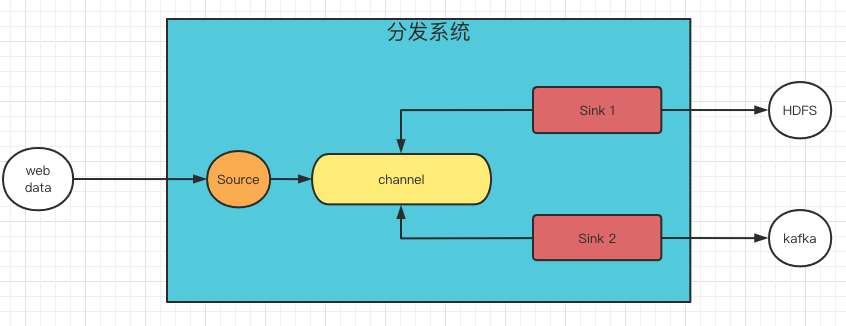

# 分发系统

## 分发系统职责

1. 提供上报接口，接收上报数据，保证上报数据的可靠性。
2. 负责对上报数据的多路分发，隔离各路分发之间的相互影响。

## 设计

为了解决上报数据的可靠性和多路分发的隔离性，分发系统由3个模块构成。

1. Source
   
   Source负责提供可定制的网络协议，满足上报方对于数据时效性，网络延迟，吞吐的不同要求。
   
2. Channel

    Channel负责对上报的数据进行持久化，保证上报数据的可靠性，保证多路分发的隔离性。
           
3. Sink

    Sink负责消费Channel数据，分发到具体系统中。
    

## 特征

1. Source端上报协议需要根据业务特性进行开发，分发系统保证Source端协议的可定制化。
    
   如网络环境好，延迟要求低，吞吐要求高的场景，可以使用tcp+自定义应用层协议或者http2.0长链接协议等。
       
   如网络环境差，丢包率高，对数据延迟敏感的场景，可以使用udp + 自定义应用层协议。

2. Channel支持多路Sink重复读取数据（读放大设计），每一路Sink的读取相互独立，保证隔离性。
    
   为了应对可能出现的Sink失败，Channel支持一定的事务性，当Sink失败时回滚偏移量重新消费，当消费成功时提交偏移量避免重复消费。

3. Sink端支持对各个分发系统的对接，分发系统保证Sink端实现的可定制化。
    
   Sink下游主要包括HDFS、KAFKA、HBASE等系统。
   
   Sink需要屏蔽消费Channel的技术细节，同时预留接口支持对Channel数据进行格式转化并输出到特定系统中。
   

## 开源产品对比

开源产品中，[Apache Flume](https://flume.apache.org/)是各大公司使用较多的产品，和Apache Flume相比，Tributary项目的优势在于：

1. 专为多路分发而设计
   
   
   
   上图是Flume多路分发的架构设计，为了实现多路分发之间的隔离性，Flume为每一路分发单独设置channel，由Source负责写入。
   
   即使用写放大策略实现多路分发的隔离性。当分发数据集规模较小的场景下，写放大所带来的开销可以接受，而对于超大数据规模，这样的设计基本无法满足对成本和性能的要求。
   
   PS：Flume对于Channel接口的定义只能做到单个Sink消费，如果改动这块设计基本是不可能完成的工作，因为很多Flume Channel的实现如Memory Channel等都没有考虑多Sink的场景。
   
2. 代码质量

   包括但不仅限于Flume Sink HDFS小文件问题，并发问题，鉴权性能问题，数据丢失隐患问题等。  
    
