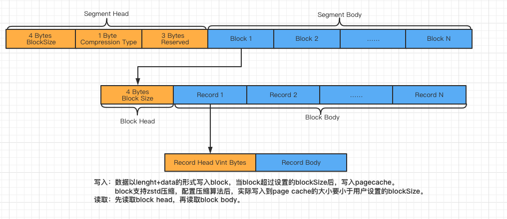

# Tributary-Queue

Tributary Queue是[分发系统](../doc/what_is_dispatcher.md)关于channel部分的定义与实现。

## 分发系统基本要求

- 故障隔离

  分发系统中，下游的SLA保障可能存在差异，分发系统需要容忍短期下游的故障，不影响其他几路的正常分发。

- 数据可靠

  当分发系统故障时，已经ack客户端发送的数据能够在分发系统恢复后可以继续下发，保证数据可靠完整。

- 屏蔽Sink间吞吐与延迟差异

  不同Sink吞吐与延迟取决于下游实际存储介质。

  如HDFS为高吞吐设计，需要在分发系统中暂存更久地数据；Kafka相对于HDFS则更偏向于低延迟设计，意味着需要暂存在分发系统的数据会小一些，与服务器端的交互延迟更低。

## 文件队列设计

为应对上述需求，需要设计一个可靠的文件队列。文件队列以磁盘作为存储介质，最大程度保证了数据的可靠性，同时提高了暂存数据的规模。

当需要暂存较大数据量时，基于内存实现Channel可能会造成严重的GC，从而影响各路数据分发的效率甚至可能导致程序奔溃。

另外与传统队列不同，文件队列设计成了pull的模式，和push模式相比，pull模式具有更好的隔离性，不需要同步等待所有下游数据消费成功。

各个下游消费者只需要维护各自的文件偏移量，当出现故障只需要设计自身的故障策略，不影响写入端和其他消费者的消费行为。

接口设计如下：

```java
public interface LogQueue extends Closeable, LogQueueMeta {

    void append(int partition, byte[] record, int offset, int length) throws IOException;

    void flush() throws IOException;

    RecordsResultSet poll(int partition, RecordsOffset recordsOffset, long time, TimeUnit unit)
            throws IOException, InterruptedException;

    RecordsOffset getRecordsOffset(String groupId, int partition);

    void commit(String groupId, int partition, RecordsOffset recordsOffset) throws IOException;
}
```

接口说明：

- append() 负责将数据写入文件队列，该操作只负责将数据写入内存block中，不保证数据写入至PageCache或磁盘。
- flush() 负责将数据从内存刷入磁盘。
- poll() 负责获取指定分区偏移量数据。
- getRecordsOffset() 获取特定groupId在某个分区的偏移量。主要用于第一次读取队列数据时用于参数传入，默认第一次读取从数据最早的偏移量开始。
- commit() 负责将groupId及其偏移量信息提交给队列，队列负责持久化该数据，保证程序重启后恢复offset，另外能让文件队列基于此信息即使删除过期文件。

隔离性体现：poll()的参数设计可以发现，各下游消费者需要指定RecordsOffset参数，这意味着每个下游可以独立读取文件队列中任意文件的数据。

当成功分发后可以commit，当分发失败时，可以从getRecordsOffset获取上次提交的offset进行Rollback操作重新消费。

每个消费者通过groupId字段进行标识，从而保证互不影响。

所有消费者都commit成功的文件会被标记为可删除，等待异步线程删除这些文件释放PageCache。

Tips: 虽然文件队列没有限制用户读取的位置，但是如果用户读取被标记为删除的文件可能会报FileNotFoundException，所以在Sink项目中，对读取的Offset做一定的判断，保证不会读取小于commit的文件地址。

具体详见：[LoqQueue.java](../tributary-queue/src/main/java/org/zicat/tributary/queue/LogQueue.java)。

# 文件队列实现

在开源产品中，基于Kafka实现Channel是较为简单的，基本满足了对于Channel隔离性和可靠性的要求。但Kafka也存在一些不足，包括：

1. Offset设计和索引结构

   Kafka基于Offset定位数据文件实际偏移量，要想做到这点，需要在写入数据文件的同时，写入Offset和文件偏移量的索引文件，存在性能浪费。

   实际上针对分发系统中Channel的设计，只需要保留实际文件Offset对文件进行直接操作，不需要保存Offset与文件偏移量的物理映射。

2. Kafka服务化

   Kafka将日志操作服务化使得每一批数据都需要通过网络进行数据传输，而Channel完全可以将数据写入本地磁盘，少一次网络传输的开销。

3. 数据生命周期

   分发系统在正常状态下，当所有下游消费完成后即可将数据文件删除，保证了操作系统PageCache的快速释放，而Kafka不支持主动删除Segment，存在磁盘空间和PageCache的浪费。

   虽然Kafka支持设置数据过期，但是过小地过期时间无法应对故障的场景，而分发系统当出现故障后可以保留数据文件直到恢复消费后进行主动删除。

4. 数据备份

   Kafka为了保证服务的可靠性，将数据进行备份，对于分发系统，单个分发Instance出现故障可以主动下线，将分发流量转移至其他Instance从而保证单点故障的可靠性。

   一般而言在消费没有延迟的情况下，磁盘故障更多的是影响写入，当写入失败后Instance下线，此时未消费完的数据还在PageCache中可以继续消费直到所有ack数据全部推送完成即可。

基于上述原因，Dispatcher-Queue实现了基于本地文件的LogQueue，这样的设计保证了部署分发系统不需要额外的外部依赖，但对机器的磁盘空间和存储效率有一定的要求。

# 本地文件队列设计

## 本地文件队列特性

- 写入读取延迟

  通过jvm信号量进行写入与读取协调，保证了数据实时读取。

- 乱序

  文件队列保证相同分区内的数据有序性，不保证全局有序。

- 可靠性

  为了保证数据的快速写入与读取，数据写入成功无法保证数据可靠地写入磁盘，用户可以通过flush和定时刷盘策略保证相对的可靠性。

## Segment结构设计

由于分发系统中数据往往以短生命周期存在，理论上一份数据分发完成后就可以从磁盘中删除，但是为了迎合磁盘的基本特性，文件队列往往以Segment的方式进行文件管理。

一个Segment文件对应一小部分有限数据集，具有固定大小，由文件队列负责其生命周期管理，Segment的生命周期包括：创建，可读可写，只读，过期删除。

Segment不宜过小，因为频繁创建和删除会引入额外的性能开销，同样Segment不宜过大，因为过大的Segment无法及时删除会占用过多操作系统PageCache资源。Segment文件的合理大小在2G-4G左后。



Segment内部数据按照固定大小的block进行管理，写入操作负责将数据写入block中，当block填充完整后，一次系统调用写入PageCache。

按照block进行管理的好处在于屏蔽了小数据（小于4K以下的数据）对写入的性能影响，对稳定写入有极大的好处。

一般合适的block为32K，如果记录本身较大如超过1K，可以适当增大block。

Segment支持按block粒度进行压缩，在写入block时，数据会先压缩再写入，所以写入至磁盘的block和内存中的block大小存在出入。

具体详见：[LogSegment.java](../tributary-queue/src/main/java/org/zicat/tributary/queue/file/LogSegment.java)。

## 文件队列设计

文件队列主要功能包括：Segment生命周期管理、刷盘机制、消费组的管理与持久化。

- Segment生命周期管理

  Segment创建阶段，读取至最新offset的线程会await，文件队列保证只有一个写入线程负责对现有Segment进行操作，包括：标记为只读并存放至缓存中，创建新Segment，唤醒读取线程。

  在队列创建时，启动清理线程，负责清理缓存中过期的Segment。

- 刷盘机制

  将PageCache数据写入磁盘是一个非常耗时的操作，一般的机械盘每秒写入在200mb/s，同步刷盘必然会导致写入端的响应延迟。

基于上述问题，文件队列创建时，创建刷盘线程，负责将当前可写的segment进行异步刷盘操作。

同时为了保证PageCahe数据过渡积压，写入一定PageCache后进行同步刷新。

- 消费组的管理与持久化

  负责将读取线程提交的offset写入磁盘中，并提供当前消费的最小偏移量，清理线程根据该偏移量标记过期Segment并清理。

具体详见：[FileLogQueue.java](../tributary-queue/src/main/java/org/zicat/tributary/queue/file/FileLogQueue.java)
、[PartitionFileLogQueue.java](../tributary-queue/src/main/java/org/zicat/tributary/queue/file/PartitionFileLogQueue.java)
。 