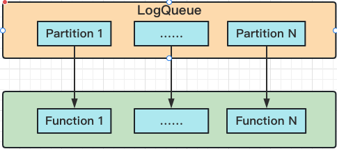
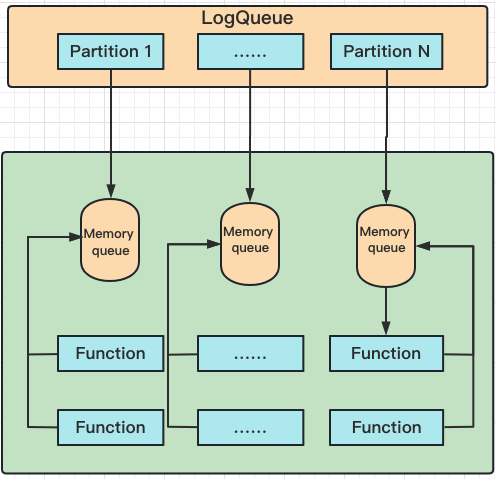

# Tributary-Sink

Tributary-Sink是[分发系统](../doc/what_is_dispatcher.md)关于Sink部分的设计与实现。

Tributary-Sink基于[Tributary-Queue](../tributary-queue/README.md)提供多种消费模型，并对实际消费需求进行抽象，简化文件队列的使用门槛。

## Sink 模型

文件队列支持多分区设计，每个分区相互独立。基于此背景，现有的消费模型包括：simple、disruptor。

### Simple模型

Simple模型将文件分区和线程一一绑定，适用于单线程消费速率高于单分区写入速率的场景。

上图中一个[SimplePartitionHandler](tributary-sink-base/src/main/java/org/zicat/tributary/sink/handler/SimplePartitionHandler.java)
对应一个线程，负责读取文件队列数据，并把数据委托给Function进行进一步处理， 详见设计：[SimpleSinkHandlerFactory](
tributary-sink-base/src/main/java/org/zicat/tributary/sink/handler/factory/SimplePartitionHandlerFactory.java)
。

### Disruptor模型

Disruptor模型将文件单个分区与多个消费线程绑定，适用于单线程消费速率低于单分区写入速率的场景。 对比Simple模型，Disruptor需要使用更多的Cpu资源和内存资源。

该模型存在一个弊端，即破坏了单分区内的数据有序性，所以该模型只适用于对乱序不敏感的场景。 如果需要保证有序，则可以采用Simple模式并适当增加分区数量从而降低单分区的写入速率，使得单分区生产和消费平衡。

上图中一个DisruptorPartitionHandler对应一个线程，负责读取文件队列数据，并将数据再次推送到内存队列中。

DisruptorPartitionHandler会根据设置的线程数派生对应数量的线程消费内存队列中的数据（上图的线程数为2），并把数据委托给Function进行进一步处理，
详见设计：[DisruptorPartitionHandlerFactory](tributary-sink-base/src/main/java/org/zicat/tributary/sink/handler/factory/DisruptorPartitionHandlerFactory.java)
。

## 消费抽象

无论是Simple模型还是Disruptor模型，都支持配置[FunctionFactory](tributary-sink-base/src/main/java/org/zicat/tributary/sink/function/FunctionFactory.java)
，用于开发实际的业务逻辑。

FunctionFactory基于[Java SPI](https://www.journaldev.com/31602/java-spi-service-provider-interface-and-serviceloader)
进行依赖注入，用户根据实际需求拓展，
如：[DummyFunctionFactory](tributary-sink-base/src/main/java/org/zicat/tributary/sink/function/DummyFunctionFactory.java)
。

完成ProcessFactory开发后，在resources下创建META-INF.services目录，创建[org.zicat.tributary.sink.function.FunctionFactory](tributary-sink-base/src/main/resources/META-INF/services/org.zicat.tributary.sink.function.FunctionFactory)
文件，并将开发的ProcessorFactory写入文件。

### Function

[AbstractFunction](tributary-sink-base/src/main/java/org/zicat/tributary/sink/function/AbstractFunction.java)
是业务开发的基类。

[AbstractFunction](tributary-sink-base/src/main/java/org/zicat/tributary/sink/function/AbstractFunction.java)
保证同一个function只绑定在一个线程下运行，一般情况下不需要考虑线程安全问题。

## 子模块

- [Tributary-Sink-Kafka](tributary-sink-kafka) 提供Sink Kafka能力。

- [Tributary-Sink-HDFS](tributary-sink-hdfs) 提供Sink HDFS能力。

## 其他特性

1. [AbstractFunction](tributary-sink-base/src/main/java/org/zicat/tributary/sink/function/AbstractFunction.java)
   可以实现[Trigger](tributary-sink-base/src/main/java/org/zicat/tributary/sink/function/Trigger.java)
   接口，设置idle时间并当idle时进行回调。

2. 配置参数maxRetainPerPartition

   设置每个分区最多保留多少数据文件，该特性应对下游长时间故障导致磁盘空间不足的问题，当然配置触发时，会导致数据丢失，用户根据实际业务场景进行配置。

## 整体Demo

可参考测试用例[PartitionHandlerTest](tributary-sink-base/src/test/java/org/zicat/tributary/sink/test/handler/PartitionHandlerTest.java)
。