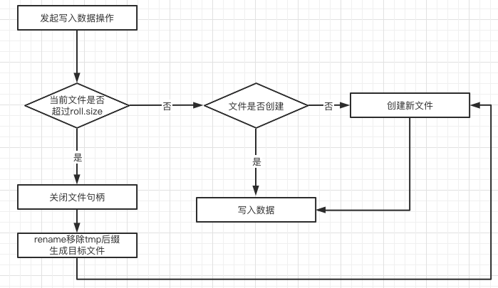

# Tributary-Sink-HDFS
Tributary-Sink-HDFS基于[Tributary-Sink-Base](../README.md)提供Sink HDFS能力。

## AbstractHDFSFunction

[AbstractHDFSFunction](src/main/java/org/zicat/tributary/sink/hdfs/AbstractHDFSFunction.java)是此项目的核心类。

核心功能：提供HDFS写入，压缩，Rotate，kerberos授权等。

## 核心概念

### Bucket
一个Bucket唯一对应文件系统的一个目录，配合参数sinkPath，可以构建一个完整的路径。

如：sinkPath=/warehouse/ bucket=b1，则完整的路径为 /warehouse/b1/。

[AbstractHDFSFunction](src/main/java/org/zicat/tributary/sink/hdfs/AbstractHDFSFunction.java)维护了Bucket到BucketWriter的对应关系。

[AbstractHDFSFunction.appendData(String bucket, byte[] bs, int offset, int length)](src/main/java/org/zicat/tributary/sink/hdfs/AbstractHDFSFunction.java)
方法根据指定的bucket获取BucketWriter（若不存在，则创建），通过BucketWriter将数据写入目标路径，一个bucket同时只有一个BucketWriter。

[AbstractHDFSFunction.closeBucket(String bucket)](src/main/java/org/zicat/tributary/sink/hdfs/AbstractHDFSFunction.java)方法根据指定的bucket关闭BucketWriter。

### [BucketWriter](src/main/java/org/zicat/tributary/sink/hdfs/BucketWriter.java)
一个BucketWriter负责在一个bucket下创建文件，写入数据，关闭文件，rename等一些列操作。


#### BucketWriter默认写入流程



#### Payload
在创建BucketWriter对象时，用户可以指定一个Payload对象，用于存放用户需要的信息，Payload的生命周期和BucketWriter的生命周期一一对应。


## HDFS 数据可靠性方案
### 传统设计
#### 分发侧
1. 开启事务，创建一个临时文件
   
    如：/tmp/aaa.snappy.parquet.tmp
2. 将数据写入此文件
3. 等待写入一定大小后关闭文件
4. 重命名文件
   
    如：/tmp/aaa.snappy.parquet.tmp -> /tmp/aaa.snappy.parquet

5. 提交事务

#### 计算侧

扫描/tmp下非tmp结尾的文件并计算。

优势：写入侧和计算侧不需要设计复杂的协调逻辑。

劣势：数据重复或者丢数据，对云原生不友好。

#### 数据重复或者丢数据
假设程序可能随时Crash。
1. 当程序执行第5步Crash，程序恢复，重新回滚消费
   
    Crash前rename成功的文件保留了下来，计算侧会计算这些数据与回滚数据产生重复。

2. 当程序第4步Crash，程序恢复，从最新的数据开始消费
   
    Crash前的文件还没有rename成功，计算则会丢弃这部分数据导致数据丢失。

只要程序crash，无论采用哪种恢复策略，都会导致数据的重复或者丢失。

### 开源项目Flume设计
Flume对每append一批数据都会调用hdfs的flush方法将数据从客户端缓存刷新到服务端，然后提交事务，关闭文件和重命名操作失败时只支持重试，多次重试失败只是以log的形式记录下来。
这种设计是一种偏乐观的设计，随时都有丢数据的风险。

### 云原生不友好
云上一般不会自建HDFS集群，而是采用云厂商的对象存储，如OSS、S3等。
对象存储对于rename操作基本等同于重写一个新对象，并删除旧对象，可见rename操作非常耗时。

### 重新设计Sink HDFS的可靠性

#### 分发侧
1. 开启事务，创建目标文件
   
    如 /tmp/aaa.snappy.parquet
2. 将数据写入此文件
3. 等待写入一定大小后关闭文件
4. 将文件名信息记录到内存中
5. 攒够一定数量文件后，将信息以文件形式提交到hdfs上并提交本地事务
      
   如：/tmp/_meta.json，内容形如：
    ```json
      [   
          "/tmp/aaa.snappy.parquet",
          "/tmp/bbb.snappy.parquet"
      ]
     ```
#### 计算侧
获取_meta.json下的文件列表进行计算。

优势：
1. 当程序crash时，总是从上次提交的事务开始消费，这样有效地避免了数据丢失问题。
2. 是否能够避免重复
    
    步骤5中，如果meta文件提交hdfs成功，还没提交本地事务时Crash，程序重启同样会造成数据重复消费。怎么解决呢？
     
    我们可以将本地事务信息一并提交到meta文件中，即将这两步操作合并成一个原子操作，如：
     ```json
      {   
          "files": [ "/tmp/aaa.snappy.parquet","/tmp/bbb.snappy.parquet"],
          "transaction":{"fileId":"123", "offset":123123}
      }
     ```
   当程序恢复时，从meta中读取transaction信息进行恢复即可保证数据精准一次消费。

PS：由于绝大多数项目采用先写tmp，再rename的方案，所以分发框架将这部分实现在了基类[BucketWriter](src/main/java/org/zicat/tributary/sink/hdfs/BucketWriter.java)中，并通过Payload和重写BucketWriter中的一些关键方法实现方案2。

#### 实现细节简介
通过重写[AbstractHDFSFunction.initializeBucketWriter(String bucketPath, String realName)](src/main/java/org/zicat/tributary/sink/hdfs/AbstractHDFSFunction.java)，可以实现修改默认行为。

具体改造逻辑可以结合实际业务，如构造[BucketWriter](src/main/java/org/zicat/tributary/sink/hdfs/BucketWriter.java)对象时，重写createTmpWriterPath()方法，不再写tmp文件而直接写目标文件，重写renameBucket()方法，将文件添加至内存。
等待合适时机调用closeBucket后获取BucketWriter中的Payload对象，提交成功写入hdfs的文件信息。
```java
@Override
protected BucketWriter<BucketStatistics> initializeBucketWriter(
        String bucketPath, String realName) {

    return new BucketWriter<BucketStatistics>(
            bucketPath,
            realName,
            snappyCodec,
            new HDFSCompressedDataStream(),
            privilegedExecutor,
            rollSize,
            maxRetry,
            new BucketStatistics(bucketPath),
            clock) {
        @Override
        public void append(byte[] bs, int offset, int length) throws IOException {
            super.append(bs, offset, length);
            updateStatistics(itemIdentity, payload, lastRecordsOffset);
        }

        @Override
        protected String createTmpWriterPath() {
            // use payload to list success write file, so write hdfs file directly.
            return targetPath;
        }

        @Override
        protected void renameBucket(String bucketPath, String targetPath, final FileSystem fs) {
            // because writer hdfs file directly, need not rename bucket.
            payload.addFile(fullFileName);
        }
    };
}
```

