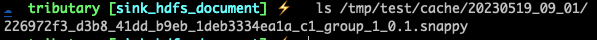

# Sink HDFS Document

## Common Completed Configuration

```properties
server.port=8765
source.s1.channel=c1
source.s1.implement=netty
source.s1.netty.port=8200
source.s1.netty.decoder=lineDecoder
channel.c1.type=memory
channel.c1.groups=group_1
sink.group_1.functionIdentity=hdfs
sink.group_1.sinkPath=/tmp/test/cache
sink.group_1.roll.size=10240000
sink.group_1.bucketDateFormat=yyyyMMdd_HH_mm
sink.group_1.bucketDateTimeZone=UTC
sink.group_1.maxRetries=3
sink.group_1.keytab=
sink.group_1.principle=
sink.group_1.idleTriggerMillis=30000
```

[Let's start the tributary service](../../doc/user_guide.md) using the above configuration and construct some data.

Try to use the telnet to send some records, please attend to the port if source.s1.netty.port changed.


Due to the configuration setting of sink.group_1.bucketDateFormat to create a new bucket every minute, a data file will be generated in the subdirectory where sink.group_1.sinkPath is located after a one-minute wait.

At the same time, due to the configuration of sink.group_1.idleTriggerMillis as 30 seconds, if the input data channel is idle for 30 seconds, a data file will also be generated in the subdirectory where sink.group_1.sinkPath is located.



The above demo uses the local HDFS file system. How can I switch to another file system? Simply add the related HDFS configuration files such as hdfs-site.xml and core-site.xml to TRIBUTARY_CONF.

## Questions

1. How to read those data files?
  
   [Read Demo](../../sample-code/src/main/java/org/zicat/tributary/demo/sink/HDFSSinkFileReader.java)
   
2. How to change data format in HDFS sink

   The HDFS sink controls the file format for writing to HDFS through the [HDFSWriterFactory](src/main/java/org/zicat/tributary/sink/hdfs/HDFSWriterFactory.java).
   
   Therefore, the first step is to inherit from [HDFSWriterFactory](src/main/java/org/zicat/tributary/sink/hdfs/HDFSWriterFactory.java) to implement customized requirements.
   
   The second step is to inherit from [DefaultHDFSFunction](src/main/java/org/zicat/tributary/sink/hdfs/DefaultHDFSFunction.java) to override like below.
   
   ```java
   
   @Override
   protected BucketWriter<P> initializeBucketWriter(String bucketPath, String realName) {
           return new BucketWriter<>(
                   bucketPath,
                   realName,
                   //create your HDFSWriterFactory 
                   yourHDFSWriterFactory,
                   privilegedExecutor,
                   rollSize,
                   maxRetry,
                   null);
   }
   ```
   
   The third step is to inherit from [DefaultHDFSFunctionFactory](src/main/java/org/zicat/tributary/sink/hdfs/DefaultHDFSFunctionFactory.java) to override like below. 
   
   ```java
    @Override
    public Function create() {
         // create Your HDFS Function
        return new YourHDFSFunction();
    }

    @Override
    public String identity() {
        //set your hdfs function id
        return "your_hdfs";
    }
   ```

    The forth step is add the file named org.zicat.tributary.sink.function.FunctionFactory in resources/META-INF.services, and add the full name of Your HDFSFunctionFactory in it. 
    Modify sink.group_1.functionIdentity to your hdfs function id.
   
  
   
